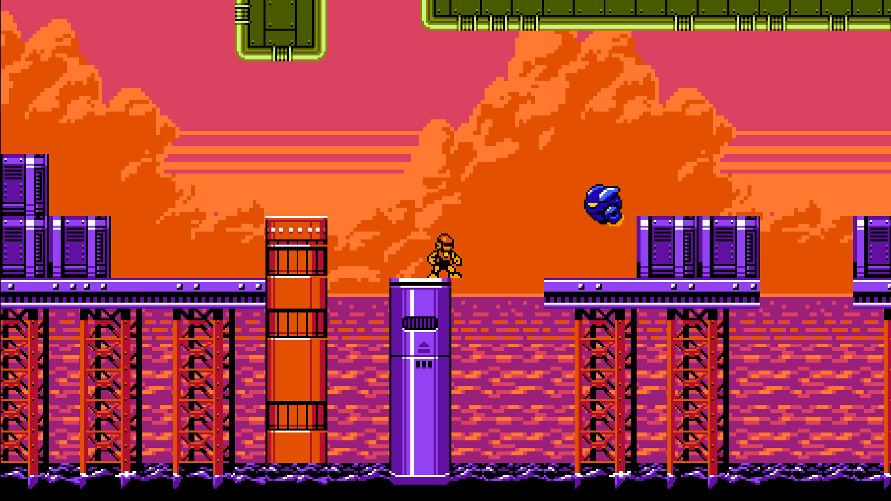

# Godot Engine 4: Aprendiendo a desarrollar videojuegos con Godot Engine 4

### Lo que veremos en esté artículo:
- [Introducción](#introducción)
- [¿Qué es Godot Engine?](#¿qué-es-godot-engine)
    * [¿Por qué empezar usando Godot?](#¿por-qué-empezar-usando-godot)
    * [Es multiplataforma](#es-multiplataforma)
    * [Mi experiencia con Godot Engine](#mi-experencia-con-godot-engine)
- [Conclusión](#conclusión)
- [Siguiente artículo](#siguiente-artículo-introducción-a-godot-engine-4)

## Introducción
Hoy en esté árticulo verémos cómo podemos crear nuestros propios videojuegos
desdé cero utilizando el [motor de videojuegos](https://es.wikipedia.org/wiki/Motor_de_videojuego) Godot Engine, aprenderemos los conceptos
fundamentales para la creación de videojuegos en Godot Engine 4 y cómo podemos exportarlos a diferentes plataformas.
**¡Comenzemos!**

## ¿Qué es Godot Engine?
Godot Engine, es un entorno de desarrollo [open source](https://es.wikipedia.org/wiki/Software_de_c%C3%B3digo_abierto) multiplataforma versátil y flexible para la creación y diseño de aplicaciones principalmente videojuegos, proporcionandonos un conjunto de herramientas y componentes que nos son de gran utilidad a la hora de crear y diseñar nuestros propios videojuegos, además es de un proceso de aprendizaje bastante rápido lo que significa que en poco tiempo se puede aprender de forma rápida cómo usar las herramientas que nos ofrece Godot ya qué la interfaz gráfica de Godot es muy intuitiva y amigable para los usuarios. 

### ¿Por qué empezar usando Godot?
Godot además cuenta con una [documentación](https://docs.godotengine.org/en/stable/index.html) bastante completa en la qué se explica a detalle cada característica del motor y cuenta con una gran comunidad activa de desarrolladores lo que significa que cuenta con una gran cantidad de recursos en línea, cómo tutoriales, cursos y complementos de desarrollo para ayudar a los desarrolladores a aprovechar el motor al máximo.

### Es multiplataforma
Godot Engine es un motor de videojuegos multiplataforma lo que significa que Godot tiene soporte para una variedad diferente de plataformas, cómo Linux, Windows, MacOS e incluso Android, además de qué podemos exportar nuestros proyectos a cada una de estas plataformas.

### Mi experencia con Godot Engine
En mi propia experencia, Godot Engine me ha parecido una excelente herramienta para comenzar en el mundo del desarrollo de los videojuegos debido a lo rápido qué es el proceso de aprendizaje por ejemplo en una semana ya habia aprendido a usar la mayoria de las herramientas de godot, y qué ademas es una experencia muy satisfactoria y entretenida a la hora de crear nuestros videojuegos con él, personalmente desdé que comencé a usarlo me ha gustado mucho por todas las ventajas que ofrece y qué además te abre un campo de posibilidades en el cual el único límite es tú imaginación.

# Conclusión
Godot Engine 4 es un motor de desarrollo de videojuegos que es versátil que ofrece una amplia gama de características y herramientas para creadores de videojuegos y aplicaciones, y sobre todo es accesible para personas con cualquier nivel de experiencia.

## Siguiente artículo: Introducción a Godot Engine 4
En el siguiente artículo aprenderemos sobré las caractarísticas básicas de Godot Engine 4
y a navegar en su interfaz gráfica para comenzar a crear nuestros proyectos Godot:

[Godot 4: Introducción a Godot Engine 4](articulo_2_introduccion_a_godot.md)
