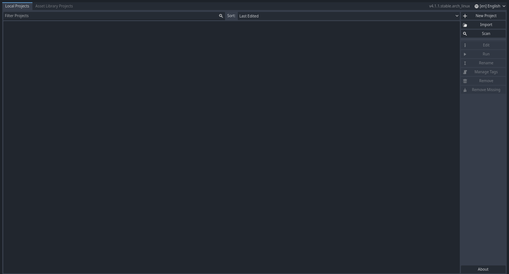

# Godot Engine 4: Introducción a Godot Engine 4

## Introducción a Godot Engine 4
- [Introducción](introducción)
- [Descargando e instalando Godot Engine](#descargando-e-instalando-godot-engine)
- [Conociendo la interfaz gráfica del Project Manager](#conociendo-la-interfaz-gráfica-del-project-manager)
- [Creando un nuevo proyecto en godot](#creando-un-nuevo-proyecto-en-godot)
- [Estructura de un proyecto Godot](#estructura-de-un-proyecto-godot)
- [Conclusión](#conclusión)
- [Siguiente artículo](#siguiente-artículo-introducción-a-nodos-y-escenas)

## Introducción
En el [artículo anterior](articulo_1_introduccion.md) aprendímos sobre las características fundamentales de Godot Engine 4 y porque comenzar a desarrollar videojuegos usando este [motor de videojuegos](https://es.wikipedia.org/wiki/Motor_de_videojuego).

Ahora en este artículo aprenderemos a descargarlo e instalarlo, a navegar en el Project Manager y verémos cómo es la estructura básica de un proyecto en Godot.

**¡Comencemos!**

## Descargando e instalando Godot Engine

### Descargando Godot
Antes de continuar, cabe destacar que a medida vayan saliendo nuevas actualizaciones
pueden ir cambiando las características del editor y del motor, por lo qué es recomendable mantenerse
al tanto de los cambios y diferencias que hay de una versión y otra, al momento de escribir este artículo estoy
usando la versión 4.1.1 de Godot Engine, dejándo eso en claro, prosigamos con la descarga e instalación de
Godot Engine.

Para descargar Godot nos iremos al [sitio oficial](https://godotengine.org/) para descargar la última versión 
que esté disponible en ese momento.

Daremos click donde dice Download Latest

Nos redirigira a la página de descarga de la última versión de Godot para nuestro sistema operativo y haremos click en la primera opcíón que sólo dice Godot Engine, en mi caso como estoy usando una distribución Linux me aparece una página de descarga para Linux, pero en caso que tengas otro sistema operativo cómo Windows o MacOS te debería redirigir a la página correspondiente de descarga para el sistema operativo que estés usando.

### Instalación de Godot

Cuando se termine la descarga nos quedará un archivo cómo esté:

Lo siguiente que debemos hacer ahora es descomprimir el archivo y nos quedará una carpeta cómo la siguiente:

Abrimos la carpeta y ahí encontraremos el ejecutable de godot:

Ahora sólo damos doble click sobre el ejecutable para abrirlo y ¡ya tendrémos a Godot ejecutandosé en nuestra computadora!

## Conociendo la interfaz gráfica del Project Manager
Cuándo nosotros abrímos Godot por primera vez nos encontraremos con la interfaz del manejador de proyectos o el [project manager](https://docs.godotengine.org/en/stable/tutorials/editor/project_manager.html), esta interfaz nos proporciona de varios elementos visuales e interactivos con los que podemos administrar nuestros proyectos godot:

## Veamos las partes que componen esta interfaz gráfica

### Esquina superior derecha

En la esquina superior derecha podemos observar primero la versión actual que estámos usando de Godot en nuestro sistema operativo, y a la derecha podemos observar un desplegable en el que si hacemos click se nos desplegará un menú en el que podemos cambiar el idioma del editor, se recomienda elegir el inglés como idioma del editor ya qué la mayoría de cursos y tutoriales que encontrarás en internet usan el inglés como lenguaje del editor, sin embargo eres libre de elegir el lenguaje de tu preferencia.

### Esquina superior izquierda

#### Local Projects
En esta parte podemos observar un panel de pestañas con una pestaña Local Projects que es donde podemos ver una lista con nuestros proyectos locales además de un panel de botones para la creación de nuevos proyectos, importar proyectos y escanear directorios o carpetas donde tengamos guardados nuestros proyectos Godot, además contamos con otras opciones de edición de proyectos cómo editar, ejecutar, renombrar, manejar etiquetas, remover el proyecto de la lista de proyectos locales y remover todos los proyectos de la lista de proyectos que no hayan podido ser encontrados en sus directorios correspondientes debido a que hayan sido eliminados o se hayan movido a otro directorio, y ya por último al final del panel de opciones de edición de proyectos, podemos observar un bóton "Acerca de" qué nos provee de información sobre los desarrolladores del motor y las licencias que útiliza Godot.

En Local Projects podemos observar también un campo de entrada de texto "Filter projects" donde podemos escribir el nombre de un proyecto que queramos buscar en la lista de proyectos, esto es muy útil para cuando tenemos una lista larga de proyectos y queremos acceder de forma rápida la proyecto. También podemos observar un menú desplegable Sort: en el cuál podemos elegir el criterio en el que se deben ordenar los proyectos en la lista cómo ordenar por última modificación(Last modified), Nombre(Name), Ruta del directorio(path) y etiquetas(Tags).

#### Asset Library Projects
Luego de las pestaña de Local Projects, podemos observar otra pestaña llamada Asset Library Projects:

En esta pestaña nosotros podemos buscar recursos en línea que hayan subido otros desarrolladores, cómo librerías y útilidades para mejorar la eficiencia a la hora de desarrollar videojuegos, demos de proyectos en desarrollo y plantillas para ayudarnos a estructurar mejor nuestros proyectos.

### Creando un nuevo proyecto en Godot
Ahora que ya conocemos más sobre la interfaz principal de Godot, vamos a crear nuestro primer proyecto en Godot.

Nos vamos a la pestaña Local Projects de Godot en el Project Manager y damos en el boton de New Project:

Nos aparecera una ventana emergente en la que debemos escribir el nombre de nuestro proyecto, la ruta, la compatibilidad de renderizado, y el controlador de versiones:

Para crear nuestro proyecto en Godot debemos hacer lo siguiente:

1. Lo primero que haremos será darle un nombre al proyecto que vamos a crear en nuestro caso Mi_primer_videojuego_en_godot.

2. Luego en Project Path damos click en browse para abrir el explorador de archivos y buscar el directorio en el que queremos guardar la carpeta de nuestro proyecto.

3. Una vez hemos buscado y seleccionado donde queremos guardar nuestro proyecto daremos click en el bóton Create Folder que nos creara la carpeta donde se guardará nuestro proyecto godot.

4. Luego en el apartado de Renderer, vamos a elegir una de las 3 opciones que nos da godot dependiendo de las necesidades de nuestro proyecto como a las plataformas a las que queramos dar soporte de nuestro proyecto, las opciones a elegir son las siguientes:
    - Forward+: 
        Marcando esta opción hará que en nuestro proyecto podamos utilizar opciones avanzadas para la creación de videojuegos 3D avanzados, pero reduce la compatibilidad de los pr
        oyectos con esta opción a ser compatible sólo con plataformas de escritorio.
    - Mobile: 
        Marcando esta opción hará que en nuestro proyecto podamos darle soporte tanto a plataformas de escritorio y plataformas móviles, con esta opción marcada es mayormente recomendable para la creación de videojuegos 2D, se pueden también crear videojuegos 3D pero las opciones con las que contaremos serán limitadas debido a que su objetivo es ser dar el mayor rendimiento posible para poder darle soporte a las plataformas moviles.
    - Compatibility: 
        Marcando esta opción hará que nuestro proyecto sea compatible con la mayoría de las plataformas cómo plataformas de escritorio, plataformas móviles, plataformas web e incluso soporte para dispositivos con pocos recursos a nivel de hardware. Principalmente está opción es utilizada para el desarrollo de videojuegos 2D con el objetivo de que sean compatibles con la mayoría de dispositivos y plataformas.

En nuestro caso vamos a elegir la opción de Renderer Compatibility ya que luego lo utilizaremos para ¡crear nuestro primer videojuego 2D en Godot!

5. Una vez ya hemos elegido el renderer que va a utilizar nuestro proyecto, podemos ver una opción en la que por defecto estará seleccionado el [sistema de control de versiones](https://es.wikipedia.org/wiki/Control_de_versiones) Git lo dejaremos como está
6. Y ya por último sólo debemos dar click en Create & Edit

## Estructura de un proyecto Godot
Los proyectos en Godot se estructuran en forma de carpetas donde a su vez pueden contener más carpetas dependiendo del propósito o contenido que vaya a tener cada carpeta.
En los proyectos Godot vamos a necesitar separar los diferentes componentes del proyecto en varias carpetas cómo las escenas, los scripts, y los recursos de nuestras aplicaciones y videojuegos cómo las texturas cómo los spritesheets, o los módelos 3D, los efectos de sonido, archivos con metadatos, etc.

Tal como podemos ver en esta imagen así sería la estructura básica de un proyecto godot.

Podemos observar también un archivo project.godot, estos archivos básicamente lo que hacen es guardar la información sobre la configuración de las propiedades de cada proyecto.

# Conclusión
En este artículo hemos aprendido a cómo descarga e instalar godot, a navegar en su interfaz de Project Manager o manipulador de proyectos y cómo crear un nuevo proyecto en Godot además de que vimos cómo es la estructura básica de un proyecto Godot.

## Siguiente artículo: Introducción a Nodos y Escenas
En el siguiente artículo aprenderemos sobre un tema bastante importante para el desarrollo de aplicaciones y videojuegos en Godot: Nodos y Escenas
Son los bloques de construcción con los cuáles creamos nuestras aplicaciones y videojuegos en Godot.

Siguiente artículo: [Godot 4: Introducción a Nodos y Escenas](articulo_3_nodos_y_escenas.md)

