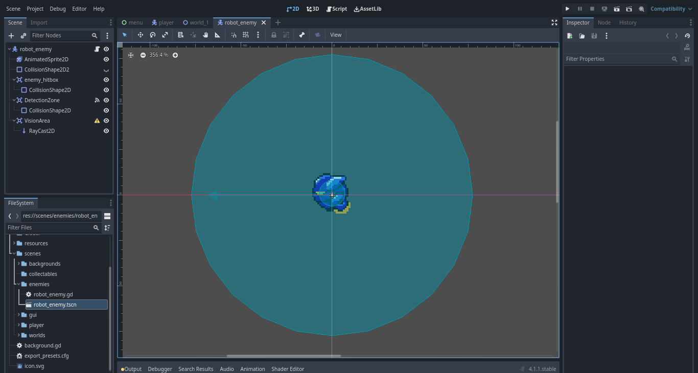
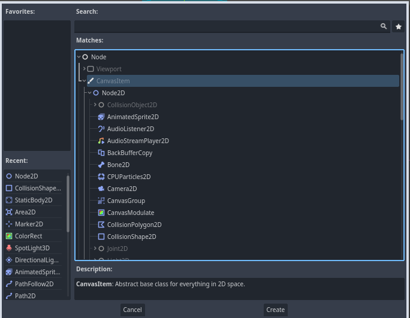
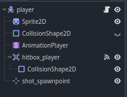

# Godot 4: Introducción a Nodos y Escenas

- [Introducción](#introducción)
- [Escenas y Nodos](#escenas-y-nodos)
    * [¿Qué es un nodo?](#¿qué-es-un-nodo)
    * [¿Qué es una escena?](#¿qué-es-una-escena)
- [Programación en Godot con GDScript](#programación-en-godot-con-gdscript)
- [Conclusión](#conclusión)
- [Siguiente artículo](#siguiente-artículo-creando-un-videojuego-2d-en-godot)

## Introducción
En el [artículo anterior](articulo_2_introduccion_a_godot.md) aprendimos a como descargar e instalar Godot Engine, lo básico de la interfaz gráfica del [project manager](https://docs.godotengine.org/en/stable/tutorials/editor/project_manager.html), como crear un nuevo proyecto en Godot y la estructura básica de un proyecto Godot.

Ahora en este artículo veremos unos de los conceptos más importantes y fundamentales que debemos conocer para poder comenzar a desarrollar nuestros videojuegos en Godot.

**¡Comenzemos!**

## Escenas y nodos
Godot Engine nos ofrece un sistema de escenas y nodos versátiles y fléxbiles, los cuáles constituyen toda la estructura, funcionamiento y organización de nuestros proyectos en Godot.

### ¿Qué es un nodo?
Los nodos son los bloques de construcción que componen todos los elementos de nuestros videojuegos, como los enemigos, el mapa, el jugador, las texturas, los sonidos, etc. Además un mismo nodo se puede reutilizar la cantidad de veces que sea requerido y a su vez también pueden contener a otros nodos que complementen sus características y funcionalidades, verémos ejemplos detallados con demostraciones en el [Siguiente artículo](articulo_4_1_introduccion_creando_un_videojuego.md).

Ejemplo de una lista de nodos de Godot:

Godot nos provee de una gran variedad de nodos, aunque sólo utilizaremos los necesarios.

### ¿Qué es una escena?
Una escena es un recurso reutilizable para organizar los elementos de un videojuego, como un enemigo, una moneda o un nivel, las escenas nos ayudan a mantener en diferentes ficheros la estructura de cada elemento, como por ejemplo la estructura de un enemigo se guarda en un archivo con extensión .tscn que podemos luego reutilizar en una escena Mundo sobre la cuál podemos mediante la escena enemigo crear varios enemigos del mismo tipo que comparten la misma estructura y no tenemos que estar creando la misma estructura por cada enemigo en nuestro mapa, verémos ejemplos detallados con demostraciones en el [Siguiente artículo](articulo_4_creando_un_videojuego_en_godot.md).

Ejemplo de la estructura de la escena del jugador:

Si quieres profundizar más sobre las escenas y nodos, te recomiendo leer la [documentación oficial de godot sobre escenas y nodos](https://docs.godotengine.org/es/stable/getting_started/step_by_step/nodes_and_scenes.html)

## Programación en Godot con GDScript
En Godot tenemos la posibilidad de decirle a los nodos como se deben de comportar de acuerdo a un estado o un evento en particular, como por ejemplo los eventos del teclado para controlar el movimiento de nuestro personaje y la lógica de un personaje en el videojuego en general, todo esto se hace mediante el propio [lenguaje de programación de Godot](https://es.wikipedia.org/wiki/Lenguaje_de_programaci%C3%B3n) llamado GDScript, en este artículo no profundizaremos mucho en este tema por lo que si quieres aprender más sobre GDScript te recomiendo leer la [documentación oficial de Godot sobre scripts y GDScript](https://docs.godotengine.org/es/stable/getting_started/introduction/learn_to_code_with_gdscript.html#learn-in-your-browser-with-the-gdscript-app)

## Conclusión
En este artículo hemos aprendido sobre los conceptos fundamentales de nodo y escena en Godot y su importancia en el desarrollo de videojuegos, también aprendimos un poco sobre lo que es GDScript y su uso.

## Siguiente artículo: Creando un videojuego 2D en Godot
En el siguiente artículo veremos la primer parte de cómo crear nuestro primer videojuego 2D en godot
y verémos en práctica los conceptos de nodo y escena:

[Godot Engine 4: Crea tú primer videojuego con Godot Engine 4 desdé cero](articulo_4_1_introduccion_creando_un_videojuego.md)

