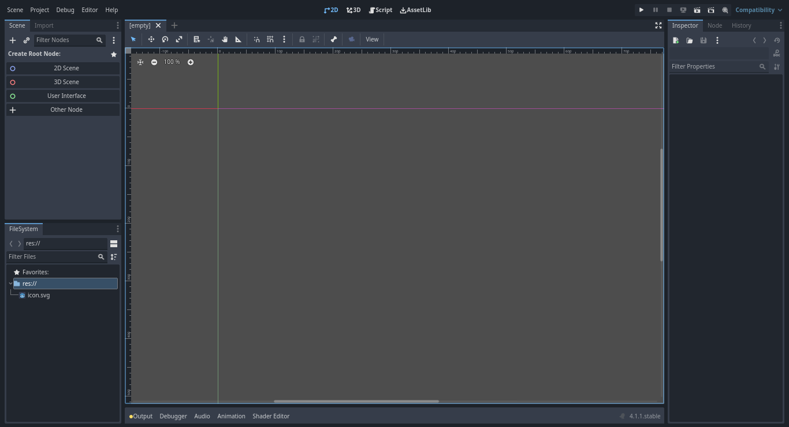

# Godot Engine 4: Crea tú primer videojuego con Godot Engine 4 desdé cero
## Parte 1: Introducción

- [Introducción](#introducción)
- [Creando el proyecto para nuestro videojuego](#creando-el-proyecto-para-nuestro-videojuego)
- [Una breve introduccion a la interfaz grafica del editor de godot](#veamos-una-breve-introduccion-a-la-interfaz-grafica-del-editor)
- [Conclusión](#conclusión)
- [Siguiente parte](#siguiente-parte)

## Introducción
En el [artículo anterior](articulo_3_nodos_y_escenas.md) aprendimos lo básico sobre los nodos y las escenas, sin embargo no vimos como crearlos y utilizarlos, en este artículo vamos crear nuestro primer videojuego con todo lo que hemos visto hasta ahora, veremos por ejemplo como crear las escenas y nodos para el jugador, los enemigos, y un nivel usandola para demostrar como funcionan las **estructuras de escenas y nodos** en Godot.

Antes de comenzar veamos cuales serán los elementos básicos que tendrá nuestro videojuego:

1. Un personaje jugable
2. Un nivel con un gameplay basico
3. Enemigos con mecanicas sencillas

Este artículo está subdivido en 5 partes dónde en cada parte nos enfocamos en un tema diferente en el proceso de la creación de nuestro primer videojuego:

* [Parte 1: Introducción](articulo_4_1_introduccion_creando_un_videojuego.md)
2. [Parte 2: Agregando los recursos para nuestro videojuego](articulo_4_2_descarga_asset_pack.md)
3. [Parte 3: Creando la escena Player de nuestro personaje](articulo_4_3_escena_player.md)
4. [Parte 4: Creando la escena Mundo](artiuclo_4_4_escena_mundo.md)
5. [Parte 5: Creación de la escena enemigo](articulo_4_5_escena_enemigo.md)

**¡Empezemos!**

## Creando el proyecto para nuestro videojuego
Primero vamos a crear el proyecto para nuestro primer videojuego en Godot, en el [segundo artículo de esta serie](articulo_2_introduccion_a_godot.md#creando-un-nuevo-proyecto-en-godot) vimos cómo crear un proyecto en Godot por lo que en este artículo no vamos a profundizar mucho en esta parte.

### Veamos una breve introducción a la interfaz gráfica del editor

Una vez hemos creado nuestro proyecto, deberá aparecernos una interfaz como la siguiente:

En la parte superior veremos un panel con las siguientes opciones: 

* La opción 2D es para utilizar el editor de escenas 2D.
* La opción 3D es para utilizar el editor de escenas 3D.
* La opción Scripts es para abrir la interfaz del editor de scripts.
* La opción Asset Libs es para abrir el navegador de assets y librerías en línea qué podemos utilizar en nuestro proyecto.

En este artículo nos centraremos principalmente en la opción de 2D y la opción Scripts.

Seleccionamos la opción 2D y nos quedará de la siguiente forma:

Podremos observar varios paneles de edición de nodos y escenas, administración de archivos, e incluso un panel de pestañas para la edición de animaciones, audio, tilesets, tilemaps, y realizar pruebas de nuestros videojuegos mediante depuraciones.

En este artículo no vamos a profundizar mucho sobre cada uno de los componentes de la interfaz gráfica del editor de Godot más allá de los que vamos a utilizar, por lo que si quieres aprender más sobre cada uno de estos componentes te recomiendo leer la [documentación óficial de godot sobre la interfaz gráfica](https://docs.godotengine.org/es/stable/getting_started/introduction/first_look_at_the_editor.html) o buscar tutoriales y cursos en linea.

## Conclusión
En este artículo hemos aprendido lo básico sobre los componentes gráficos de la interfaz de Godot y hemos creado un nuevo proyecto para el desarrollo de nuestro videojuego, en la siguiente parte veremos como descargar los asset pack para nuestro videojuego y colocarlos en nuestro proyecto para poder utilizarlos.

## Siguiente parte:
[Parte 2: Agregando los recursos para nuestro videojuego](articulo_4_2_descarga_asset_pack.md)
