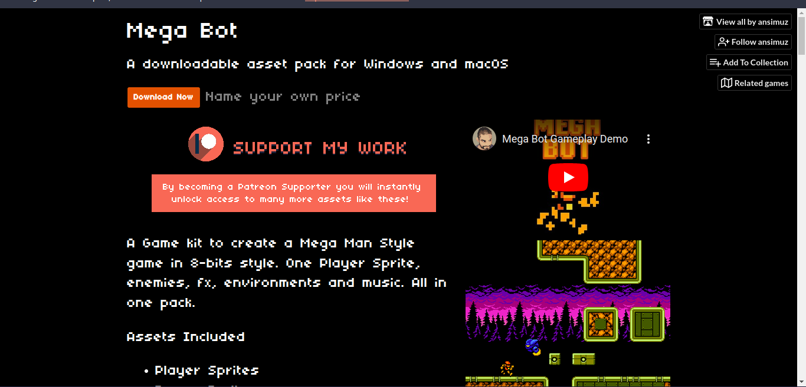
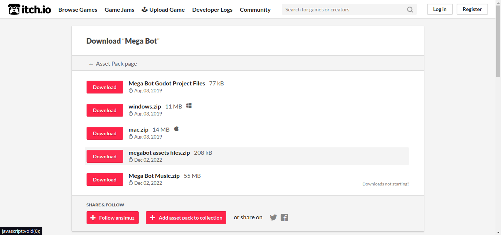
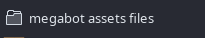
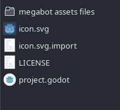
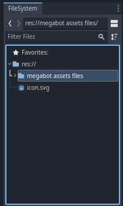

# Godot Engine 4: Crea tú primer videojuego con Godot Engine 4 desdé cero
## Parte 2: Agregando los recursos para nuestro videojuego

[Introducción](#introducción)
[Descargando el asset pack](#descargando-el-asset-pack)
[Agregando el asset pack a nuestro proyecto](#agregando-el-asset-pack-a-nuestro-proyecto)
[Conclusión](#conclusión)
[Siguiente parte](#siguiente-parte)

## Introducción
Ahora que ya hemos visto una breve una introducción a la interfaz gráfica del editor de Godot y tenemos una noción de los conceptos básicos de Godot, podemos comenzar a crear nuestro propio videojuego con las herramientas que nos ofrece. 

## Descargando el asset pack
Primero descargaremos un paqueté de recursos(assets pack) que utilizaremos en el desarrollo de nuestro videojuego, en este caso utilizaremos el asset pack de uso líbre y gratuito del proyecto [Mega Bot](https://ansimuz.itch.io/mega-bot) que es un videojuego al estilo Mega Man.

Enlace: https://ansimuz.itch.io/mega-bot

Daremos click izquierdo en el bóton que dice **Dowload Now** y luego si no queremos donar, damos click dónde dice **No thanks, just take me to the downloads**, y nos enviará a la siguiente página: 

Descargaremos el archivo que dice megabot asset files.zip: 

Una vez descargado, lo descomprimimos, quedandonos la siguiente carpeta:

## Agregando el asset pack a nuestro proyecto
Para agregar el asset pack a nuestro proyecto, buscaremos la carpeta que está en el interior de la carpeta que nos quedo luego de descomprimir el archivo que descargamos del asset pack y la copiaremos en la carpeta dónde hemos creado nuestro proyecto godot, la carpeta de nuestro proyecto godot debe de quedar de la siguiente manera:

Una vez tenemos la carpeta con los assets en la carpeta de nuestro proyecto, entramos a nuestro proyecto en godot y revisaremos en el panel de exploración de archivos de nuestro proyecto si todo salío bien, si es así se debería de ver de la siguiente manera:

## Conclusión
En esta parte hemos aprendido a cómo descargar el asset pack que utilizaremos en el desarrollo de nuestro videojuego y como agregarlo a nuestro proyecto godot.

## Siguiente parte:
[Parte 3: Creando la escena Player de nuestro personaje](articulo_4_3_escena_player.md)

