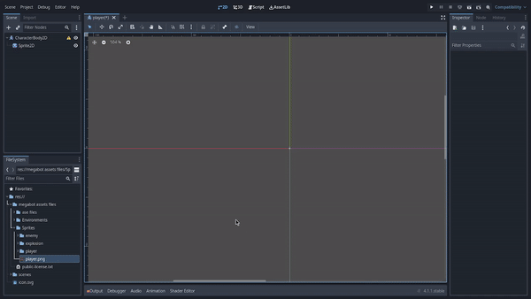
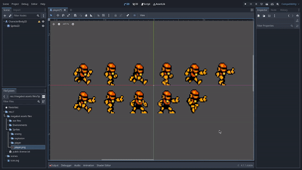
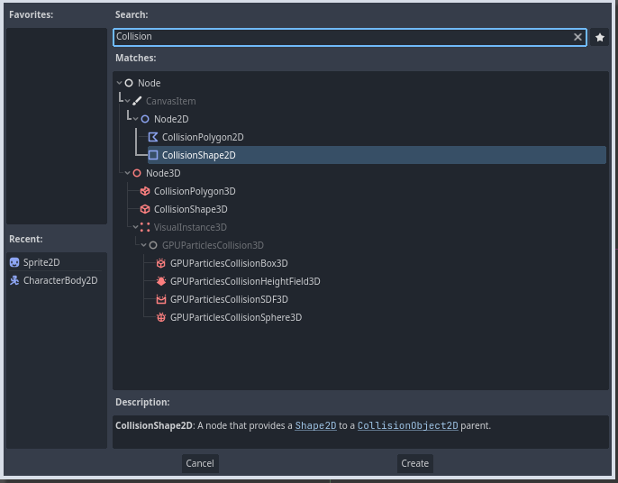
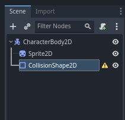
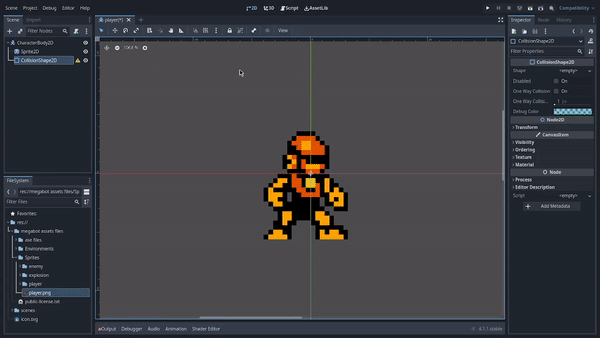
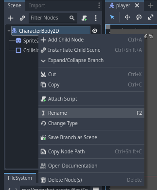
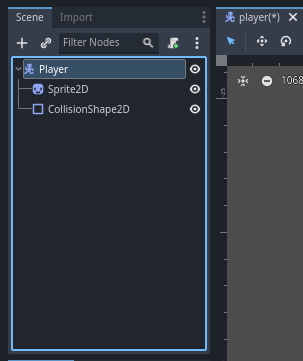
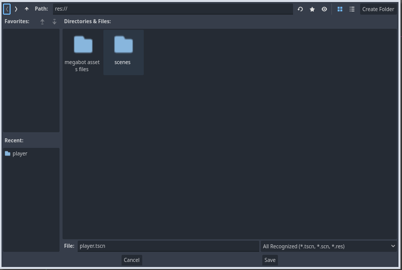
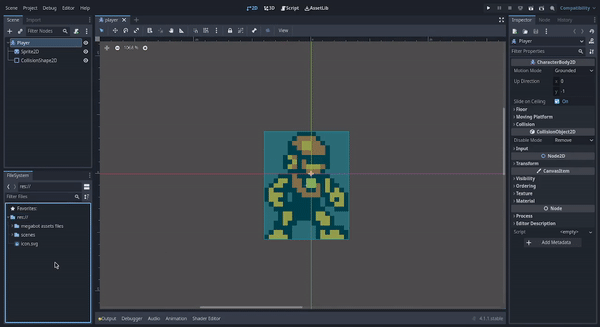

# Godot Engine 4: Crea tú primer videojuego con Godot Engine 4 desde cero
## Parte 3: Creando la escena Player de nuestro personaje

- [Introducción](#introducción)
- [Creando la escena Player de nuestro personaje](#creando-la-escena-player-de-nuestro-personaje)
- [Dándole apariencia a nuestro personaje](#dándole-apariencia-a-nuestro-personaje)
- [Cambiando el filtro de textura](#cambiando-el-filtro-de-textura)
- [Agregando las colisiones a nuestro personaje](#agregando-las-colisiones-a-nuestro-personaje)
- [Renombrando nuestra escena CharacterBody2D a Player](#renombrando-nuestra-escena-characterbody2d-a-player)
- [Guardamos la escena y organizamos un poco](#guardamos-la-escena-y-organizamos-un-poco)
- [Conclusión](#conclusión)
- [Siguiente artículo](#siguiente-artículo)

## Introducción
Ahora vamos a crear la escena player o jugador de nuestro personaje.

## Creando la escena Player de nuestro personaje

Lo primero debemos hacer es agregar un nodo de tipo CharacterBody2D que será el nodo principal de la estructura de la escena de player, para eso nos vamos al panel de edición de escena:

Daremos click izquierdo en el botón **Other Node** y nos aparecerá una ventana como la siguiente:

En este panel podemos ver todos los tipos de nodos disponibles que podemos usar en godot por ahora buscaremos el nodo CharacterBody2D que es el que vamos a usar, para eso daremos click izquierdo en el campo de texto debajo de **Search** y escribimos CharacterBody2D:

Lo seleccionamos y damos click izquierdo en en el botón **Create** para crear el nodo.

Una vez creado nos aparecerá en el panel de edición de escenas de la siguiente manera:

Los nodos de tipo CharacterBody2D se útilizan para la creación de personajes y enemigos en los videojuegos, contienen por ejemplo las propiedades para la posición y desplazamiento de los enemigos y nuestro personaje además de un sistema heredado para la detección de colisiones, para más información sobre este tipo de nodos recomiendo leer la [documentación óficial de godot sobre los nodos de tipo CharacterBody2D](https://docs.godotengine.org/en/4.1/tutorials/physics/using_character_body_2d.html).

## Dándole apariencia a nuestro personaje

Ahora que ya tenemos creado el nodo CharacterBody2D, debemos darle el aspecto gráfico que tendrá en el juego.

Lo primero que debemos hacer será crear un nodo de tipo Sprite2D al interior del nodo CharacterBody2D que hemos creado anteriormente, para eso debemos dar click derecho sobre el nodo CharacterBody2D en el panel de edición de escena y nos debe desplegar un menú como el siguiente:

Y daremos click izquierdo en la opción que dice **Add Child Node** para desplegar nuevamente la ventana de selección del tipo de nodo a añadir:

Veremos que estará en la busqueda anterior que hicimos para el nodo CharacterBody2D, ahora daremos click izquierdo en el campo de texto debajo de **Search:** borramos y escribimos Sprite2D:

Y por último daremos click izquierdo en el botón **Create** para crear el nuevo nodo.
Una vez creado el nuevo nodo, la estructura de la escena nos debe de quedar como la siguiente:

Como podemos ver el nuevo nodo que acabamos de crear se a creado adentro del nodo CharacterBody2D, así es cómo los nodos se pueden crear en el interior de otros nodos, y lo mismo podemos hacer con otros nodos que se encontrarán en el interior de otros nodos.

Los nodos Sprite2D con este tipo de nodos podemos darle el aspecto gráfico que tendran nuestros personajes o enemigos.

Bien, ahora que hemos creado el nodo Sprite2D, lo siguiente será asignarle la imagen o textura del aspecto gráfico de nuestro personaje, en mi caso voy a utilizar un sprite sheet del personaje MegaBot del asset pack que descargamos.

Vamos ahora a desplegar esa carpeta y en su interior nos deberían de aparecer otras 3 carpetas:

Desplegaremos la carpeta Sprites:

Podemos ver una imagen en formato .png llamada **player.png** que es la textura que utilizaremos para darle aspecto a nuestro personaje, para asignarla al nodo Sprite2D que habíamos creado lo haremos arrastrando la imagen al nodo Sprite2D así como se ve a continuación:

Ahora vamos a establecer en las propiedades del Sprite2D cuantas columnas y filas de frames tiene el sprite sheet de nuestro personaje, también estableceremos el frame en el que debe aperecer cuándo el personaje no se está moviendo:

**¡Ya nuestro personaje tiene apariencia!**

## Cambiando el filtro de textura
Pero ahora si nos acercamos al personaje, verémos cómo si se difuminara:

Para arreglar eso, debemos fijarnos en la parte superior izquierda del editor dónde podemos observar las siguientes opciones:

Daremos click izquierdo en Project, y luego en project settings:

Luego de hacer eso, nos debe aparecer la siguiente ventana:

En esta ventana nosotros podremos modificar las configuraciones de nuestro proyecto, la parte que nos interesa por ahora son las configuraciones de las texturas, para eso nos iremos a la parte de Rendering y darémos click izquierdo en Textures:

Al hacer click izquierdo, nos debe aparecer el siguiente panel de configuraciones:

Dónde dice Default Texture Filter, daremos click izquierdo en donde dice **Linear** y nos deben aparecer las siguientes opciones:

Seleccionamos la que dice **Nearest** y cerramos la ventana de configuraciones.

Y si todo sale bien, podremos observar ahora nuestro que personaje se verá así:

## Agregando las colisiones a nuestro personaje
Ahora que nuestro personaje ya tiene apariencia, vamos a añadir las colisiones de nuestro personaje.

Para eso vamos a crear un nuevo nodo de tipo CollisionShape2D que son los nodos con los que definimos la forma de las colisiones de los personajes y enemigos, el proceso de creación del nodo es el mismo que hemos visto anteriormente para la creación del nodo Sprite2D:
1. Damos click derecho sobre el nodo CharacterBody2D.
2. Damos click izquierdo en la opción **Add Child Node**
3. Buscamos el tipo de nodo en la lista de tipos de nodos que nos muestra la ventana emergente
4. Seleccionamos el tipo de nodo que estamos buscando y damos click izquierdo en el botón **Create** y ya tendremos nuestro nuevo nodo creado.

**Nota**: Para crear o añadir nodos al interior de otro nodo, sólo damos click derecho sobre el nodo en el cuál queremos añadir el nuevo nodo y seguimos los mismos pasos que hemos visto anteriormente para la creación de nodos, también si ya tenemos un nodo creado y queremos meterlo en otro nodo(anidación de nodos), sólo debemos arrastrar el nodor que queremos anidar y lo llevamos al nodo destino.

## Dándole forma a la colisión de nuestro personaje

Ahora que ya hemos creado el nodo CollisionShape2D, vamos a establecer la forma que tendrá la colisión de nuestro personaje.
Para eso daremos click izquierdo sobre el nodo CollisionShape2D para seleccionarlo, y nos iremos al panel Inspector que es dónde podemos editar las propiedades de nuestros nodos tal cómo vimos en el ejemplo cuándo le asignamos el sprite sheet a nuestro personaje y modificamos las propiedades de la animación de nuestro personaje.

En este caso nosotros vamos a modificar la propiedad Shape y seleccionaremos la forma rectangular con la opción New RectangleShape2D que es la forma que utilizaremos por ahora para nuestra colisión y además ajustaremos en el viewport la forma de la colisión:

Muy bien ahora nuestro personaje ya tiene colisiones, más adelante en la siguiente parte de la creación de nuestro personaje, harémos pruebas de movimiento, animación añadiremos una hitbox para la detección de enemigos y zonas de muerte.

## Renombrando nuestra escena CharacterBody2D a Player
Podemos también asignarles nombres a nuestros nodos, sólo debemos dar click derecho sobre un nodo y dar click izquierdo en la opción **Rename**, eso nos permitira editar el nombre de nuestro nodo para que sea más fácil de identificar entre otros nodos más adelante:

Lo renombraremos a Player:

## Guardamos la escena y organizamos un poco
Listo ahora guardaremos la escena de nuestro personaje, sólo presionamos las teclas ctrl+s y nos debería aparecer el explorar de archivos dónde le daremos un nombre al archivo en el que se guardará la escena y la carpeta del proyecto donde se guardará:

Crearemos una carpeta **scenes** y en su interior crearemos otra carpeta llamada **player** dónde guardaremos nuestra escena.

También en la carpeta del proyecto vamos a crear una carpeta llamada **resources** y moveremos la carpeta de nuestros asset pack a esa carpeta, esa carpeta será donde colocaremos todas las carpetas que contengan los recursos que utilizará nuestro videojuego:

Recomiendo mucho mantener organizada la estructura de las carpetas de nuestros proyectos, ya que nuestros proyectos con el tiempo se pueden volver demasiado grandes, y si no tenemos un debido cuidado con la estructura de nuestro proyecto, en el futuro será muy díficil de mantener y probablemente se tenga que hacer todo nuevamente de cero.

## Conclusión
En esta parte hemos visto cómo crear y diseñar la escena del personaje que utilizaremos en nuestro videojuego, aunque todavía le faltan ciertos elementos cómo las animaciones y movimiento, pero será algo que veremos luego de crear nuestra escena Mundo que es dónde realizaremos las pruebas de nuestro personaje.

## Siguiente artículo
[Parte 4: Creando la escena Mundo](articulo_4_4_escena_mundo.md)
