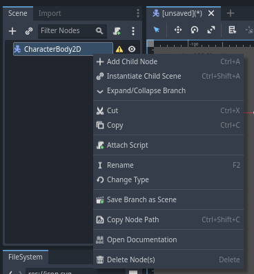
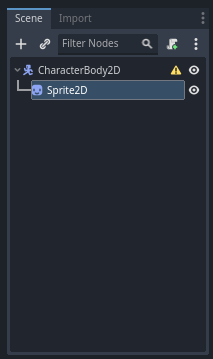

# Godot Engine 4: Crea tú primer videojuego con Godot Engine 4 desdé cero
## Parte 3: Creando la escena Player de nuestro personaje

Vamos ahora a crear la escena player o jugador de nuestro personaje.
Lo primero debemos hacer es agregar un nodo de tipo CharacterBody2D que será el nodo principal de la estructura de la escena de player, para eso nos vamos al panel de edición de escena:

Daremos click izquierdo en el botón **Other Node** y nos aparecerá una ventana como la siguiente:

En este panel podemos ver todos los tipos de nodos disponibles que podemos usar en godot por ahora buscaremos el nodo CharacterBody2D que es el que vamos a usar, para eso daremos click izquierdo en el campo de texto debajo de **Search** y escribimos CharacterBody2D:

Lo seleccionamos y damos click izquierdo en en el botón **Create** para crear el nodo.

Una vez creado nos aparecerá en el panel de edición de escenas de la siguiente manera:

**¡Felicidades, hemos creado nuestro primer nodo de escena en Godot!**

Los nodos de tipo CharacterBody2D se útilizan para la creación de personajes y enemigos en los videojuegos, contienen por ejemplo las propiedades para la posición y desplazamiento de los enemigos y nuestro personaje además de un sistema heredado para la detección de colisiones, para más información sobre este tipo de nodos recomiendo leer la [documentación óficial de godot sobre los nodos de tipo CharacterBody2D](https://docs.godotengine.org/en/4.1/tutorials/physics/using_character_body_2d.html).

### Dándole apariencia a nuestro personaje

Ahora que ya tenemos creado el nodo CharacterBody2D, debemos darle el aspecto gráfico que tendrá en el juego.

Lo primero que debemos hacer será crear un nodo de tipo Sprite2D al interior del nodo CharacterBody2D que hemos creado anteriormente, para eso debemos dar click derecho sobre el nodo CharacterBody2D en el panel de edición de escena y nos debe desplegar un menú como el siguiente:

Y daremos click izquierdo en la opción que dice **Add Child Node** para desplegar nuevamente la ventana de selección del tipo de nodo a añadir:

Veremos que estará en la busqueda anterior que hicimos para el nodo CharacterBody2D, ahora daremos click izquierdo en el campo de texto debajo de **Search:** borramos y escribimos Sprite2D:

Y por último daremos click izquierdo en el botón **Create** para crear el nuevo nodo.
Una vez creado el nuevo nodo, la estructura de la escena nos debe de quedar como la siguiente:

Como podemos ver el nuevo nodo que acabamos de crear se a creado adentro del nodo CharacterBody2D, así es cómo los nodos se pueden crear en el interior de otros nodos, y lo mismo podemos hacer con otros nodos que se encontrarán en el interior de otros nodos.

Los nodos Sprite2D con este tipo de nodos podemos darle el aspecto gráfico que tendran nuestros personajes o enemigos.

Bien, ahora que hemos creado el nodo Sprite2D, lo siguiente será asignarle la imagen o textura del aspecto gráfico de nuestro personaje, en mi caso voy a utilizar un sprite sheet del personaje MegaBot del asset pack que descargamos.

Vamos ahora a desplegar esa carpeta y en su interior nos deberían de aparecer otras 3 carpetas:

Desplegaremos la carpeta Sprites:

Podemos ver una imagen en formato .png llamada **player.png** que es la textura que utilizaremos para darle aspecto a nuestro personaje, para asignarla al nodo Sprite2D que habíamos creado lo que debemos hacer es hacer mantener click izquierdo sobre esa imagen y arrastrarla y soltarla en el nodo Sprite2D que está en la parte superior en el editor de escena y soltarlo en él:

Y nos debe ahora aparecer la textura así:

Podemos hacer zoom con la rueda del ratón y movernos horizontal y vérticalmente con las barras de desplazamiento que aparecen en la parte inferior y la parte derecha del editor visual:

Ahora para elegir un sólo sprite de las animaciones del robot primero debemos dar click izquierdo sobre el nodo Sprite2D:

Y luego nos vamos a ir a la parte derecha del editor de godot en el pánel Inspector:

Acá en este panel podremos editar las propiedades de los nodos.

Ahora queremos editar cómo se muestra la textura de nuestro personaje en el videojuego, para eso daremos click izquierdo en la opción que dice Animation:

En HFrames( cantidad de columnas de frames que posee el sprite sheet de nuestro personaje ), colocaremos 6 y nos quedará de la siguiente manera:

Ahora en VFrames( cantidad de filas de frames que posee el sprite sheet de nuestro personaje ), colocaremos 2 y nos quedará de la siguiente manera:

Y ahora para seleccionar el frame en el que mostrar a nuestro personaje por defecto, en la parte parte de Frame colocaremos el número 8:

**¡Ya nuestro personaje tiene apariencia!**

Pero, si nos acercamos más al personaje verémos cómo si se difuminara:

Para arreglar eso debemos irnos a la parte superior izquierda del editor dónde podemos observar las siguientes opciones:

Daremos click izquierdo en Project, y luego en project settings:

Y nos debe aparecer la siguiente ventana:

En esta ventana nosotros podemos modificar las configuraciones de nuestro proyecto, ahora nos interesa son las configuraciones de las texturas, para eso nos iremos a la parte de Rendering y darémos click izquierdo en Textures:

Al hacer click izquierdo, nos debe aparecer el siguiente panel de configuraciones:

Dónde dice Default Texture Filter, daremos click izquierdo en donde dice **Linear** y nos deben aparecer las siguientes opciones:

Seleccionamos la que dice **Nearest** y cerramos la ventana de configuraciones.

Y si todo sale bien, como podemos observar ahora nuestro personaje se verá así:

### Colisiones de nuestro personaje
### Moviendo a nuestro personaje
### Animando a nuestro personaje

