# Godot Engine 4: Crea tú primer videojuego con Godot Engine 4 desdé cero
## Parte 4: Creando la escena Mundo

- [Introducción](#introducción)
- [Creando la escena Mundo](#creando-la-escena-world)
- [Creando y diseñando el mapa](#creando-y-diseñando-el-mapa)
- [TileMaps y TileSets](#tilemaps-y-tilesets)
- [Creando el TileMap de nuestro mapa](#creando-el-tilemap-de-nuestro-mapa)
- [Añadiendo el diseño de los tiles](#añadiendo-el-diseño-de-los-tiles)
- [Añadiendo la capa physics layer](#añadiendo-la-capa-physics-layer)
- [¿Qué es Collision Layer y Collision Mask?](#¿qué-es-collision-layer-y-collision-mask)
- [Añadiendo colisiones a los tiles](#añadiendo-colisiones-a-los-tiles)
- [Diseñando el mapa](#diseñando-el-mapa)
- [Añadiendo nuestro personaje a la escena World](#añadiendo-nuestro-personaje-a-la-escena-world)
- [Añadiendo un fondo al mapa](#añadiendo-un-fondo-al-mapa)
- [Conclusión](#conclusión)
- [Siguiente parte](#siguiente-parte)

### Introducción
Luego de haber creado la escena de nuestro personaje, necesitaremos un lugar dónde poder hacer pruebas con las nuevas mecánicas que implementaremos más adelante a nuestro personaje, por lo que para eso necesitaremos una escena Mundo donde colocaremos a nuestro personaje.

### Creando la escena World
Primero vamos a crear una nueva escena, para eso nos vamos al panel de pestañas en la parte superior del viewport y daremos click izquierdo sobre el botón con el símbolo **+**:

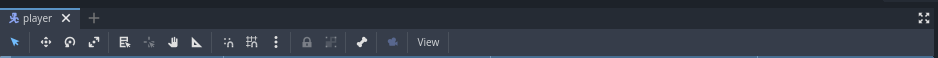

Al hacer eso se nos debe de crear una nueva escena vacía como la siguiente:

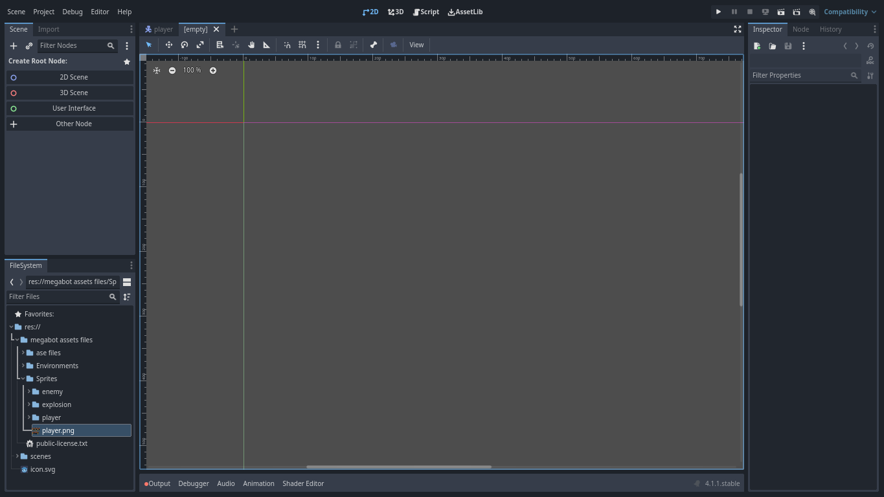

Ahora, en el panel de edición de escenas, vamos a dar click izquierdo en la opción que dice **2D Scene**:

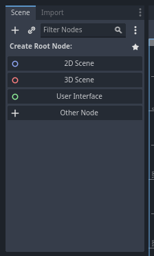

Eso nos creará un nodo de tipo Node2D qué será dónde crearemos toda la estructura de nodos de la escena Mundo:

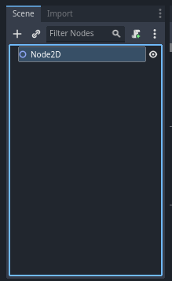

### Creando y diseñando el mapa

Una vez hemos creado la escena en la que vamos a crear el mundo de nuestro videojuego, vamos comenzar a diseñar el mapa.

### TileMaps y TileSets
Para diseñar nuestro mapa vamos a utilizar un tipo de nodo especial llamado TileMap, los tilemaps son cuadrículas o mapas de mosaicos(tiles) en la que cada casilla o mosaico es un elemento que conforma el diseño o patrón gráfico de alguna zona del mapa tal como si fueran las fichas de un rompecabezas, dónde cada ficha es un **tile** con un patrón o diseño específico y el rompecabezas sería el **tilemap**. Los diseños o patrónes de estos mosaicos conforman el TileSet o conjunto de mosaicos en el cuál podemos disponer de una gran variedad de mosaicos con diferentes patrónes y propiedades que podemos utilizar para diseñar el tilemap del mapa de la escena mundo de nuestro videojuego. 
Para profundizar más sobré los tilemaps y tilesets en godot recomiendo leer la [documentación oficial sobre tilemaps y tilesets de godot](https://docs.godotengine.org/es/stable/tutorials/2d/using_tilemaps.html).

### Creando el TileMap de nuestro mapa
Teniendo ya una idea básica de lo que son tilemaps y tilesets, podemos proceder a crear el nodo de tipo TileMap en el cual vamos a añadir los TileSets con los diseños de los tiles para diseñar nuestro mapa, y también cómo podemos añadirle colisiones a nuestros tiles.

Primero vamos a crear un nodo de TileMap, el proceso será el mismo que hemos seguido para la creación de nodos en la [primera parte de la creación de la escena Player](articulo_4_3_escena_player_parte_1.md).

1. Damos click derecho sobre el nodo Node2D.
2. Damos click izquierdo en la opción **Add Child Node**
3. Buscamos el tipo de nodo en la lista de tipos de nodos que nos muestra la ventana emergente
4. Seleccionamos el tipo de nodo que estamos buscando y damos click izquierdo en el botón **Create** y ya tendremos nuestro nuevo nodo creado.

Una vez que hayamos creado el nodo TileMap, nos debe aparecer de la siguiente forma:

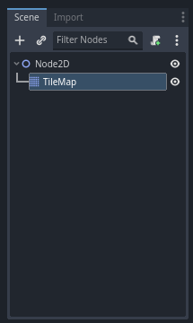

### Añadiendo el diseño de los tiles

Ahora que ya tenemos en la escena el nodo TileMap, vamos a crear un TileSet para poder comenzar a diseñar nuestro TileMap, para eso primero seleccionaremos el nodo de TileMap en el editor de escena:

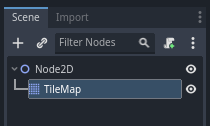

Luego nos iremos al panel Inspector para editar las propiedades del Nodo TileMap, podemos ver una propiedad llamada Tile Set:

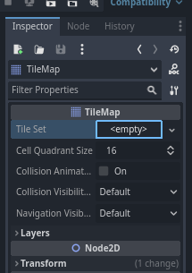

Daremos click izquierdo en dónde dice **Empty** y daremos click izquierdo **New TileSet** en el submenu que nos aparecerá:

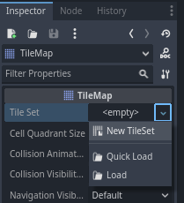

Bien con eso ya tendríamos creado el TileSet para nuestro TileMap y nos aparecería un panel de edición de TileSets como el siguiente en la parte inferior del viewport:

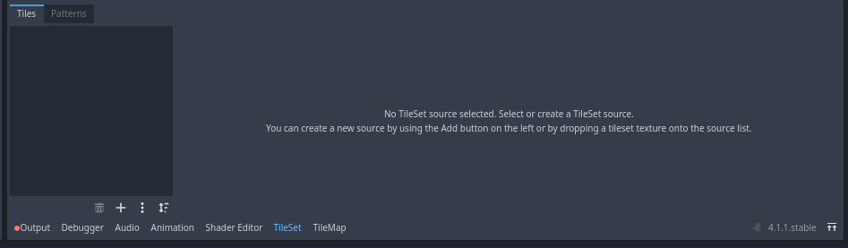

Ahora lo siguiente será cargar el sprite sheet del diseño o patrón de los tiles que usaremos para diseñar el mapa de la escena mundo.

Para eso buscaremos en el panel de explorador de archivos de nuestro proyecto la imagen con el sprite sheet del diseño de los tiles que vamos a utilizar:

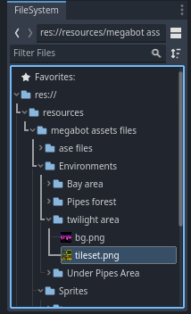

Ahora arrastraremos esa imagen al panel de edición de TileSet que nos aparecio cuándo creamos el TileSet:

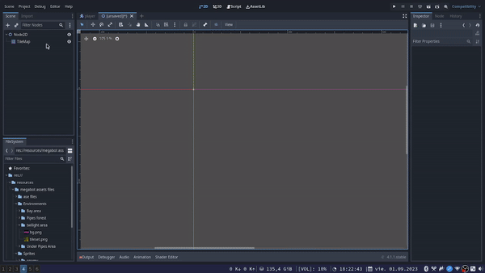

### Añadiendo la capa Physics Layer

Antes de comenzar a diseñar el mapa, vamos a añadirle las colisiones de los tiles con los que el jugador chocará en la escena.

Primero, debemos crear una capa de física**Physics Layer** a nuestro TileSet, esto se hace para que internamente el TileMap guarde la información de las colisiones de los tiles que conforman su diseño.

Para crear el **Physics Layer**, en el panel Inspector para editar las propiedades de los nodos, vamos a buscar otra vez la propiedad Tile Set del nodo TileMap:

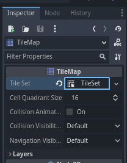

Daremos click izquierdo en TileSet y nos debería de aparecer el siguiente submenú de propiedades:

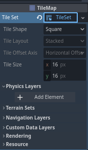

Nos fijarémos en la sección que dice **Physics Layers** que es dónde crearemos el Physics Layer para nuestro TileSet, para eso lo siguiente que harémos será dar click izquierdo sobre el botón **+ Add Element** para añadir un nuevo Physics Layer, nos quedaría algo así:

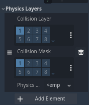

Podemos observar una tabla númerica **Collision Layer**, y otra **Collision Mask** con el número 1 marcado en ambas, vamos a marcar también el 2 en ambas tablas y nos quedará de la siguiente manera:

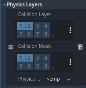

### ¿Qué es Collision Layer y Collision Mask?

Las tablas de valores Collision Mask y Collision Layer son la forma en cómo podemos definir por ejemplo como un objecto interactua con las colisiones de otros objetos y a su vez como otros objetos interactuan con la colisión de este objeto, los números de las tablas de valores que vimos anteriormente son los que nos ayudan a indicar como funcionará esa interacción.

 Para entender que son las tablas de valores de **Collision Layer** y **Collision Mask** debemos saber que las colisiones de los objetos en Godot funcionan mediante un sistema de capas de colisiones, donde la colisión de un objeto puede encontrarse en una capa u otra e incluso en varias capas al mismo tiempo, sabiendo eso entonces para conocer o definir en que capas se encuentra la colisión de un objeto, lo hacemos mediante los valores de la tabla **Collision Layer** donde cada valor índica una capa diferente, mientras que los valores de la tabla **Collision Mask** indican con que capas de colisiones puede interactuar la colisión de un objeto.

### Añadiendo colisiones a los tiles

Bien, ahora que ya nuestro TileSet tiene una capa Phisycs Layer y establecimos los valores del Collision Mask y el Collision Layer, ahora vamos a poder añadirle colisiones a los tiles de nuestro TileSet.

Primero iremos al panel de edición TileSet para seleccionar los tiles que queremos que tengan colisión:

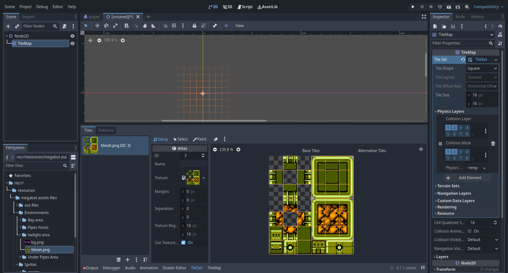

Lo he agrandado un poco para que se vea mejor, para hacer eso sólo arrastramos el borde superior del panel hacía arriba.

Ahora lo que haremos será seleccionar los tiles a los que vamos a agregarle colisión, para eso daremos click izquierdo sobre la pestaña que dice **select**:

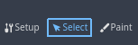

Lo siguiente será comenzar a seleccionar uno a uno los tiles del tileset a los que queremos añadirle la colisión, para eso vamos a mantener presionado la tecla shift y daremos click izquierdo sobre los tiles que queremos seleccionar, sabremos que tiles estarán seleccionados porque podremos observar un borde que los resalta:

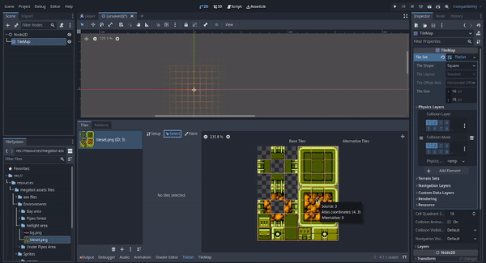

### Diseñando el mapa

### Añadiendo nuestro personaje a la escena World

### Conclusión

### Siguiente parte
[Parte 5: Creando la escena Player de nuestro personaje parte 2](articulo_4_5_escena_player_parte_2.md)
