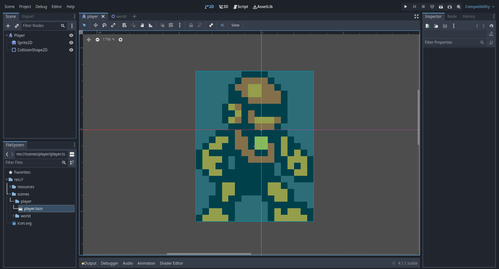
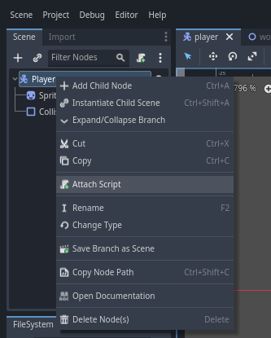
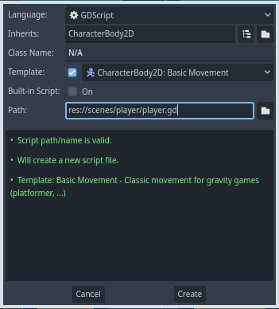
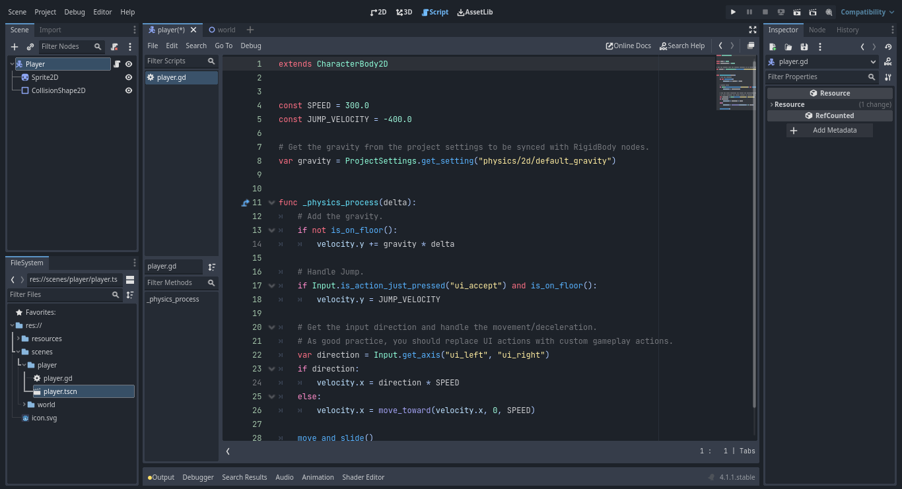

# Godot Engine 4: Crea tú primer videojuego con Godot Engine 4 desdé cero
## Parte 5: Agregando mecánicas a nuestro personaje

- [Introducción](#introducción)
- [Asignando un script a nuestro personaje](#Asignando-un-script-a-nuestro-personaje)
- [Agregando la mecánica de movimeinto](#moviendo-a-nuestro-personaje)
- [Agregando la mecánica de salto](#)
- [Animando a nuestro personaje](#animando-a-nuestro-personaje)
- [Agregando una hitbox a nuestro personaje](#agregando-una-hitbox-a-nuestro-personaje)
- [Respondiendo a señales](#respondiendo-a-señales)
- [Script completo](#script-completo)
- [Conclusión](#conclusión)

### Introducción
Ahora que ya hemos creado y diseñado el mapa de la escena mundo de nuestro videojuego y a nuestro personaje posicionado en el mapa, vamos a añadir las mecánicas de nuestro personaje, como el movimiento con las teclas, mecánica de salto y una hitbox para que nuestro personaje detecte la colisión con los enemigos.

### Asignando un script a nuestro personaje

Primero vamos a asignar el script el cual contendra la lógica de las mecánicas de nuestro personaje, para eso debemos abrir nuevamente la escena player de nuestro personaje:



Una vez tenemos abierta la escena player de nuestro personaje, vamos a proceder a asignarle un script, para eso nos iremos al panel de edición de escenas **Scene**, buscaremos el nodo con el nombre Player o CharacterBody2D si no le hemos cambiado el nombre, daremos click derecho sobre él y en el menú que nos aparecerá debemos buscar la opción **Attach Script**:



Daremos click izquierdo sobre esa opción y nos debería aparecer una ventana como la siguiente:



Dejaremos todo como está y simplemente daremos click izquierdo sobre el botón **Create** y nos debería aparecer el editor de scripts de la siguiente manera:



Nos aparecerá el código fuente de un script con la lógica de algunas mecánicas, como mover al personaje mediante el teclado y saltar, sin embargo en el script que programaremos nosotros no vamos a utilizar ese código, en su lugar usaremos el que programe para este artículo, así que vamos a borrar todo ese código, simplemente presionando las teclas ctrl+A y en la tecla de borrar o retroceso.

### Agregando la mecánica de movimiento

Para agregar la mecánica de movimiento, vamos a añadir el siguiente código fuente en el script:

```gdscript
extends CharacterBody2D

#######################################################################
# Código fuente del script para las mecánicas del jugador.
#
# Mecánicas implementadas en este código:
# 1. Mecánica de moviemiento
# 2. Mecánica de salto
######################################################################

# Velocidad máxima del personaje
@export var maxSpeed: float = 90.0

# Máxima altura que se puede alcanzar en un salto
@export var maxJumpHeight = 400.0

# Factor de gravedad
@export var gravity: float = 20.0

# Variable para comprobar si el jugador está tocando el suelo
var isOnFloor: bool = false

# Dirección del personaje
var direction: Vector2 = Vector2(0,0)

# Función para actualizar la dirección de avance del personaje en relación a las teclas
# que se hayan presionado.
func updatePlayerDirectionByInput():
	direction = Input.get_vector( "ui_left", "ui_right", "ui_up", "ui_down" )

# Función para manejar los eventos de entrada del teclado
func handleInputEvents():
	updatePlayerDirectionByInput()

# Actualiza las variables que indican en que estado se encuentra el personaje
func updatePlayerState():
	isOnFloor = is_on_floor()

# Función para realizar la acción de salto
func performJumpAction():
	velocity.y -= maxJumpHeight

# Función para actualizar sólo la velocidad horizontal
func updateHorizontalPlayerVelocity():
	velocity.x = direction.x * maxSpeed

# Función para actualizar sólo la velocidad vertical
# acá se implementa la mecánica de salto.
func updateVerticalPlayerVelocity():
	if isOnFloor and direction.y < 0.0:
		performJumpAction()

# Función para actualizar la velocidad del personaje
func updatePlayerVelocity():
	updateHorizontalPlayerVelocity()
	updateVerticalPlayerVelocity()

# Función para aplicar el factor de gravedad
func applyGravity():
	velocity.y += gravity

# Función para actualizar la física de nuestro personaje
func updatePlayerPhysics():
	if !isOnFloor:
		applyGravity()

# Función que se encarga del proceso físico del personaje
func _physics_process(_delta):
	handleInputEvents()
	updatePlayerState()
	updatePlayerVelocity()
	updatePlayerPhysics()
	move_and_slide()

```


### Animando a nuestro personaje
### Agregando una hitbox a nuestro personaje
### Respondiendo a señales
### Script completo
### Conclusión
### Siguiente Parte
