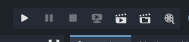
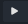
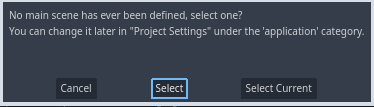
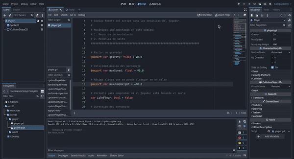
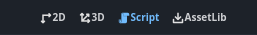
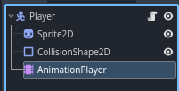
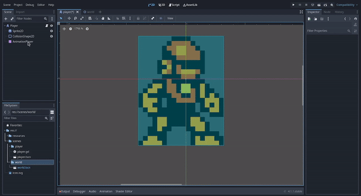
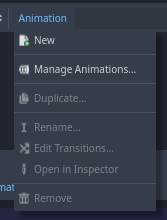
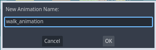
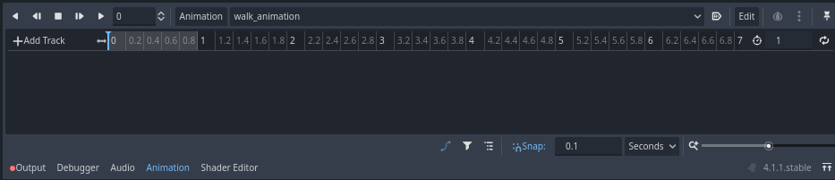

# Godot Engine 4: Crea tú primer videojuego con Godot Engine 4 desdé cero
## Parte 5: Agregando mecánicas a nuestro personaje

- [Introducción](#introducción)
- [Asignando un script a nuestro personaje](#Asignando-un-script-a-nuestro-personaje)
- [Agregando la mecánica de movimeinto](#moviendo-a-nuestro-personaje)
- [Animando a nuestro personaje](#animando-a-nuestro-personaje)
- [Agregando la animación de caminar y saltar](#agregando-la-animación-de-caminar-y-saltar)
- [Agregando una hitbox a nuestro personaje](#agregando-una-hitbox-a-nuestro-personaje)
- [Respondiendo a señales](#respondiendo-a-señales)
- [Script completo](#script-completo)
- [Conclusión](#conclusión)

### Introducción
Ahora que ya hemos creado y diseñado el mapa de la escena mundo de nuestro videojuego y a nuestro personaje posicionado en el mapa, vamos a añadir las mecánicas de nuestro personaje, como el movimiento con las teclas, mecánica de salto y una hitbox para que nuestro personaje detecte la colisión con los enemigos.

### Asignando un script a nuestro personaje

Primero vamos a asignar el script el cual contendra la lógica de las mecánicas de nuestro personaje, para eso debemos abrir nuevamente la escena player de nuestro personaje:


Una vez tenemos abierta la escena player de nuestro personaje, vamos a proceder a asignarle un script, para eso nos iremos al panel de edición de escenas **Scene**, buscaremos el nodo con el nombre Player o CharacterBody2D si no le hemos cambiado el nombre, daremos click derecho sobre él y en el menú que nos aparecerá debemos buscar la opción **Attach Script**:


Daremos click izquierdo sobre esa opción y nos debería aparecer una ventana como la siguiente:


Dejaremos todo como está y simplemente daremos click izquierdo sobre el botón **Create** y nos debería aparecer el editor de scripts de la siguiente manera:


Nos aparecerá el código fuente de un script con la lógica de algunas mecánicas, como mover al personaje mediante el teclado y saltar, sin embargo en el script que programaremos nosotros no vamos a utilizar ese código, en su lugar usaremos el que programe para este artículo, así que vamos a borrar todo ese código, simplemente presionando las teclas ctrl+A y en la tecla de borrar o retroceso.

### Script de mecánica de movimiento y salot

Para agregar la mecánica de movimiento y salto al script, vamos a añadir el siguiente código fuente en el script:

```gdscript
extends CharacterBody2D

#######################################################################
# Código fuente del script para las mecánicas del jugador.
#
# Mecánicas implementadas en este código:
# 1. Mecánica de movimiento
# 2. Mecánica de salto
######################################################################


# Factor de gravedad
@export var gravity: float = 20.0

# Velocidad máxima del personaje
@export var maxSpeed: float = 90.0

# Máxima altura que se puede alcanzar en un salto
@export var maxJumpHeight = 400.0

# Variable para comprobar si el jugador está tocando el suelo
var isOnFloor: bool = false

# Dirección del personaje
var direction: Vector2 = Vector2(0,0)

# Función para actualizar la dirección de avance del personaje en relación a las teclas
# que se hayan presionado.
func updatePlayerDirectionByInput():
	direction = Input.get_vector( "ui_left", "ui_right", "ui_up", "ui_down" )

# Función para manejar los eventos de entrada del teclado
func handleInputEvents():
	updatePlayerDirectionByInput()

# Actualiza las variables que indican en que estado se encuentra el personaje
func updatePlayerState():
	isOnFloor = is_on_floor()

# Función para realizar la acción de salto
func performJumpAction():
	velocity.y -= maxJumpHeight

# Función para actualizar sólo la velocidad horizontal
func updateHorizontalPlayerVelocity():
	velocity.x = direction.x * maxSpeed

# Función para actualizar sólo la velocidad vertical
# acá se implementa la mecánica de salto.
func updateVerticalPlayerVelocity():
	if isOnFloor and direction.y < 0.0:
		performJumpAction()

# Función para actualizar la velocidad del personaje
func updatePlayerVelocity():
	updateHorizontalPlayerVelocity()
	updateVerticalPlayerVelocity()

# Función para aplicar el factor de gravedad
func applyGravity():
	velocity.y += gravity

# Función para actualizar la física de nuestro personaje
func updatePlayerPhysics():
	if !isOnFloor:
		applyGravity()

# Función que se encarga del proceso físico del personaje
func _physics_process(_delta):
	handleInputEvents()
	updatePlayerState()
	updatePlayerVelocity()
	updatePlayerPhysics()
	move_and_slide()

```

En este artículo no se explicará a detalle cada parte de este código, sin embargo en el mismo he tratado que cada función y variable se describan a si mismas lo más claro posible, además de que deje comentarios de lo que hacen cada una.


### Probando el funcionamiento del script

Una vez hayamos copiado ese código fuente a nuestro script, vamos ahora a probar su funcionamiento.

Para eso primero debemos guardar los cambios en nuestro script presionando las teclas ctrl+s, luego nos iremos a la parte superior derecha del editor y encontraremos la siguiente barra de botones:



Daremos click izquierdo sobre el botón de play  y nos debería de aparecer la siguiente ventana emergente en la cuál se nos pide seleccionar la escena principal en la que debe iniciar nuestro videojuego:



Nosotros seleccionaremos la escena del mundo de nuestro videojuego, para eso daremos click izquierdo sobre el botón **Select**, luego nos aparecerá una ventana del explorador de archivos, lo que debemos hacer será buscar el archivo **world.tscn** de la escena de mundo y seleccionarlo:



Como podemos observar, una vez seleccionamos el archivo **world.tscn** de la escena de mundo de nuestro videojuego, se comenzará a ejecutar nuestro videojuego y podremos probar el funcionamiento de nuestro script.

El proceso de seleccionar la escena mundo como la escena principal desdé donde se comenzará a ejecutar nuestro videojuego sólo se hace una única vez, la próxima vez que demos click izquierdo sobre el botón play  para ejecutar, ya sólo se comenzará a ejecutar desde la escena que hayamos seleccionado como escena principal, en este caso la escena mundo.

Primero antes de continuar, debemos cambiarnos al editor de escenas 2D, para eso nos iremos a la parte superior del editor:



Y daremos click izquierdo en **2D** para seleccionar el editor de escenas 2D, del mismo modo si queremos cambiar al editor de scripts.

### Animando a nuestro personaje

Ahora que ya sabemos ejecutar nuestro videojuego desde la escena mundo para probar las mecánicas que hemos implementado en el script del personaje, podemos proseguir a implementar las animaciones de nuestro personaje.

Para poder crear las animaciones de nuestro personaje, vamos a necesitar un nuevo nodo de tipo AnimationPlayer:



Este nodo básicamente lo que hace es guardar la información de las animaciones de nuestro personaje, como el nombre de cada animación, el tiempo de duración total; la cantidad, la organización y la duración de los frames, etc.

Una vez hemos agregado el nodo AnimationPlayer a nuestro personaje, lo que haremos será crear una nueva animación.

Para eso primero debemos dar click izquierdo sobre el nodo AnimationPlayer, eso hará que nos aparezca un panel de edición de animaciones:



Ahora nos iremos al panel de edición de animaciones, daremos click izquierdo en el botón **Animation** que nos desplegará una lista de opciones:



Daremos click en la opción de **New** para crear una nueva animación y nos debería aparecer una ventana en la cuál debemos ingresar el nombre de la nueva animación y dar click izquierdo sobre el botón **OK**:



En este caso le he puesto **walk_animation** ya que será la animación de caminar de nuestro personaje, luego de darle click izquierdo al botón **OK** debería aparecernos el panel de edición de animaciones de la siguiente forma:



A medida que vayamos viendo cómo crear las animaciones, vamos ir entendiendo mejor cada parte del editor de animaciones.

### Agregando la animación de caminar y saltar

Ahora vamos a agregar los frames o también llamados **keyframes** que componen la animación de caminar en el spritesheet de nuestro personaje a la pista o **track** de la animación **walk_animation** que creamos en el nodo AnimationPlayer. 

Los **tracks** son las **pistas** de keyframes que creamos para cada animación-


### Agregando una hitbox a nuestro personaje
### Respondiendo a señales
### Script completo
### Conclusión
### Siguiente Parte
