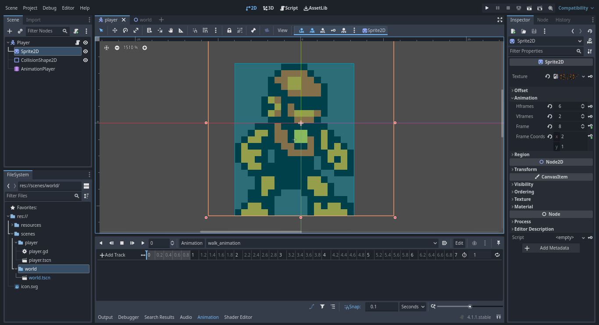
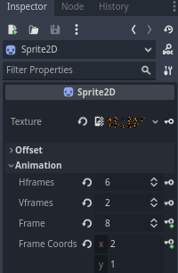
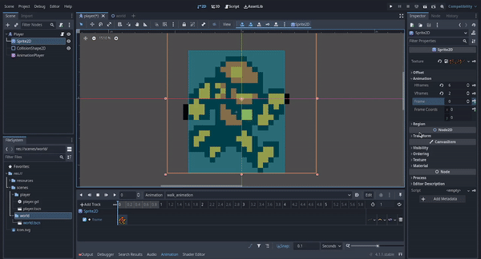

# Godot Engine 4: Crea tú primer videojuego con Godot Engine 4 desdé cero
## Parte 5: Agregando mecánicas a nuestro personaje

- [Introducción](#introducción)
- [Agregando las mécanicas a nuestro personaje](#agregando-las-mécanicas-a-nuestro-personaje)
- [Creando y asignando un script a nuestro personaje](#creando-y-asignando-un-script-a-nuestro-personaje)
- [Script de la lógica programada de las mecánicas de movimiento y salto](#script-de-la-lógica-programada-de-las-mecánicas-de-movimiento-y-salto)
- [Probando el funcionamiento del script](#probando-el-funcionamiento-del-script)
- [Animando a nuestro personaje - Animación de caminar](#animando-a-nuestro-personaje---animación-de-caminar)
- [Agregando los keyframes de la animación de caminar](#agregando-los-keyframes-de-la-animación-de-caminar)
- [Agregando una hitbox a nuestro personaje](#agregando-una-hitbox-a-nuestro-personaje)
- [Respondiendo a señales](#respondiendo-a-señales)
- [Script completo](#script-completo)
- [Conclusión](#conclusión)

### Introducción
Ahora que ya hemos creado y diseñado el mapa de la escena World y hemos posicionado al personaje en el mapa, vamos a añadir las mecánicas las mécanicas de movimiento de nuestro personaje incluyendo las animaciones que debe realizar el personaje en cada mécanica, y también se agregará y programará una hitbox para que nuestro personaje pueda detectar las colisiones con los enemigos.

### Agregando las mécanicas a nuestro personaje
Para agregar las mécancicas a nuestro personaje, vamos a necesitar programar la lógica de cada mecánica en un script GDScript que le asignaremos a nuestro personaje para poder manejar los eventos del teclado y realizar las acciones de las mecánicas de acuerdo a esos eventos del teclado.

### Creando y asignando un script a nuestro personaje

Primero vamos a asignar el script el cual contendrá la lógica programada en **GDScript** de las mecánicas de nuestro personaje, para eso debemos abrir la escena player de nuestro personaje:


Una vez hemos abierto la escena player de nuestro personaje, vamos a asignarle un script, para eso nos iremos al panel de edición de escenas **Scene**, buscaremos en la lista de nodos que hemos creado en la escena Player de nuestro personaje el nodo Player o CharacterBody2D si no le hemos cambiado el nombre, daremos click derecho sobre ese nodo y en el menú que nos desplega vamos a buscar la opción **Attach Script**:


Daremos click izquierdo sobre esa opción y nos aparecerá una ventana como la siguiente:


Dejaremos todo como está y simplemente daremos click izquierdo sobre el botón **Create** y nos debería aparecer el editor de scripts de la siguiente manera:


Nos aparecerá el código fuente de un script con la lógica programada en GDScript de algunas mecánicas, como mover al personaje mediante el teclado y saltar, sin embargo en el script que programaremos no vamos a utilizar ese mismo código, en su lugar usaremos el que he programado para este artículo, así que vamos a borrar todo ese código, simplemente presionando las teclas ctrl+A seguido de la tecla de borrar o retroceso.

### Script de la lógica programada de las mecánicas de movimiento y salto

Para agregar la mecánica de movimiento y salto al script, vamos a añadir el siguiente código fuente en el script:

```gdscript
extends CharacterBody2D

#######################################################################
# Código fuente del script para las mecánicas del jugador.
#
# Mecánicas implementadas en este código:
# 1. Mecánica de movimiento
# 2. Mecánica de salto
######################################################################


# Factor de gravedad
@export var gravity: float = 20.0

# Velocidad máxima del personaje
@export var maxSpeed: float = 90.0

# Máxima altura que se puede alcanzar en un salto
@export var maxJumpHeight = 400.0

# Variable para comprobar si el jugador está tocando el suelo
var isOnFloor: bool = false

# Dirección del personaje
var direction: Vector2 = Vector2(0,0)

# Función para actualizar la dirección de avance del personaje en relación a las teclas
# que se hayan presionado.
func updatePlayerDirectionByInput():
	direction = Input.get_vector( "ui_left", "ui_right", "ui_up", "ui_down" )

# Función para manejar los eventos de entrada del teclado
func handleInputEvents():
	updatePlayerDirectionByInput()

# Actualiza las variables que indican en que estado se encuentra el personaje
func updatePlayerState():
	isOnFloor = is_on_floor()

# Función para realizar la acción de salto
func performJumpAction():
	velocity.y -= maxJumpHeight

# Función para actualizar sólo la velocidad horizontal
func updateHorizontalPlayerVelocity():
	velocity.x = direction.x * maxSpeed

# Función para actualizar sólo la velocidad vertical
# acá se implementa la mecánica de salto.
func updateVerticalPlayerVelocity():
	if isOnFloor and direction.y < 0.0:
		performJumpAction()

# Función para actualizar la velocidad del personaje
func updatePlayerVelocity():
	updateHorizontalPlayerVelocity()
	updateVerticalPlayerVelocity()

# Función para aplicar el factor de gravedad
func applyGravity():
	velocity.y += gravity

# Función para actualizar la física de nuestro personaje
func updatePlayerPhysics():
	if !isOnFloor:
		applyGravity()

# Función que se encarga del proceso físico del personaje
func _physics_process(_delta):
	handleInputEvents()
	updatePlayerState()
	updatePlayerVelocity()
	updatePlayerPhysics()
	move_and_slide()

```

En este artículo no se explicará a detalle cada parte de este código, sin embargo he tratado de documentar con comentarios dando una descriptción simple de lo que hace cada función y variable del código.

### Probando el funcionamiento del script

Una vez hemos copiado ese código fuente a nuestro script, lo siguiente que haremos será probar su funcionamiento, para eso primero debemos guardar los cambios en nuestro script presionando las teclas ctrl+s, luego nos iremos a la parte superior derecha del editor y encontraremos la siguiente barra de botones:


Daremos click izquierdo sobre el botón de play  lo que hará nos aparezca la siguiente ventana en la cuál se nos pide seleccionar la escena principal en la que se debe iniciar la ejecución de nuestro videojuego:


Nosotros seleccionaremos la escena World que es la escena que contiene el mapa y a nuestro jugador, para eso daremos click izquierdo sobre el botón **Select**, luego nos aparecerá una ventana del explorador de archivos, lo que debemos hacer será buscar el archivo **world.tscn** de la escena de mundo y seleccionarlo:


Como podemos observar, una vez seleccionamos el archivo **world.tscn** de la escena World, se comenzará a ejecutar el videojuego desdé esa escena, donde podremos probar el funcionamiento de la lógica programada de las mecánicas de nuestro jugador.

El proceso de seleccionar la escena World como la escena principal desdé donde se comenzará a ejecutar nuestro videojuego sólo se hace una única vez, la próxima vez que demos click izquierdo sobre el botón play  para ejecutar, ya sólo se comenzará a ejecutar automáticamente desdé la escena que hemos seleccionado como escena de ejecución principal que en este caso es la escena World.

### Animando a nuestro personaje - Animación de caminar

Ahora que ya sabemos ejecutar nuestro videojuego desde la escena World para probar las mecánicas que hemos implementado en el script del personaje, vamos a implementar las animaciones de nuestro personaje.

Para comenzar a trabajar en las animaciones de nuestro personaje, seleccionaremos el editor de escenas 2D, para eso nos iremos a la parte superior del editor:


Y daremos click izquierdo en **2D** para seleccionar el editor de escenas 2D.

Para poder crear las animaciones de nuestro personaje, vamos a necesitar utilizar un nuevo nodo de tipo, el nodo AnimationPlayer:


Este nodo básicamente lo que hace es guardar la información de cada una de las animaciones de nuestro personaje, como el nombre de cada animación, el tipo de animación, el tiempo de duración total de la animación, la cantidad de frames, la organización y la duración de cada frame, etc.

Luego de haber agregado el nodo AnimationPlayer a nuestro personaje, lo siguiente que haremos será crear la animacione de caminar **walk_animation** y la animación de saltar **jump_animation**.

Para crear las animaciones, vamos a dar click izquierdo sobre el nodo AnimationPlayer para que nos aparezca el panel de edición de animaciones:


Siempre que queremos que nos aparezca ese panel de edición de animaciones, simplemente daremos click izquierdo sobre el nodo AnimationPlayer para seleccionarlo y abrir el panel de edición de animaciones.

Luego en ese panel de edición de animaciones, daremos click izquierdo en el botón **Animation** que nos desplegará una lista de opciones para el manejo de animaciones, como crear, eliminar, duplicar, renombrar, etc:


La opción que nos interesa ahora es la opción para crear una nueva animación, la opción **New**, daremos click en la opción de **New** para crear una nueva animación y nos debería aparecer una ventana en la cuál vamos a ingresar el nombre de la nueva animación, y luego daremos click izquierdo sobre el botón **OK** para crear la animación:


En este caso el nombre de la animación será **walk_animation**, ya que esta será la animación de caminar de nuestro personaje, luego de darle click izquierdo al botón **OK** para crear la animación, nos debería de aparecer el panel de edición de animaciones de la siguiente forma:


Ahora que ya hemos creado la nueva animación **walk_animation**, vamos a crear la pista o **track** de keyframes que compondrán la animación de caminar de nuestro personaje. 
Un keyframe es básicamente el estado de un nodo en un momento determinado, como por ejemplo, cada frame que compone a una animación como la animación de caminar, cada uno representa un estado distinto del nodo en un momento determinado, de ese modo al tener varios keyframes organizados de forma continua(**track**) podemos componer una animación determinada.

Para poder agregar los keyframes al **track** de la animación **walk_animation**, necesitaremos la ayuda de uno de los nodos que habíamos agregado anteriormente en la escena de nuestro personaje, el nodo Sprite2D que contiene la textura que le da el aspecto visual a nuestro personaje, lo que haremos será que estando en el panel de edición de animaciones con la animación **walk_animation** seleccionada, en el panel de edición de escena **Scene** vamos a seleccionar el nodo Sprite2D dando click izquierdo sobre él:



Al dar click sobre el nodo Sprite2D y teniendo abierto el panel de edición de animaciones con la animación de caminar **walk_animation** seleccionada, eso hará que en el panel Inspector para editar las propiedades del nodo, nos aparezcan unos pequeños botones con iconos de llaves al lado derecho de cada una de las opciones de la sección Animation del panel **inspector**:



Esos botones lo que hacen es ayudarnos a registrar en un keyframe del estado de las propiedades del nodo Sprite2D en un momento determinado, para entender mucho mejor esto, lo que haremos ahora será a comenzar a componer la animación **walk_animation**, para eso haremos lo siguiente:

Primero nos fijaremos en la propiedad **frame**:


Esta propiedad lo que hace es seleccionar el frame actual a mostrar del spritesheet de las posiciones de nuestro personaje. En este caso nos dice que es el frame número 8, que es el frame en el cuál nuestro personaje está en una posición de inactividad **Idle**.

Cada número que le podemos pasar a la propiedad **frame** representa un frame de una determinada posición de nuestro personaje, por lo que sabiendo eso, para poder componer la animación de nuestro personaje, lo que debemos hacer será ir cambiando el frame y registrando esos cambios con un keyframe que se añadirá al **track** de la animación **walk_animation** de nuestro personaje.

### Agregando los keyframes de la animación de caminar
Ahora entendiendo el funcionamiento de la propiedad **frame** del nodo Sprite2D, lo siguiente que haremos será comenzar a agregar los keyframes de la animación de caminar al **track** de la animación **walk_animation**,
para eso ,lo primero que haremos será darle un número a la propiedad **frame** que sea el primer frame de las posiciones de caminar de nuestro personaje, en este caso es el frame número 0: 


Ahora daremos click izquierdo sobre el botón con el icono de llave que está al lado derecho de la propiedad
**frame**, eso nos mostrará una ventana emergente en la que debemos dar click izquierdo en el botón **Create** para comenzar a añadir los keyframes:


Ahora que ya hemos creado el primer keyframe de la animación de caminar, vamos a dar click izquierdo en el mismo botón con el ícono de llave para agregar más keyframes al **track** el número de veces necesarias dependiendo de la cantidad de frames de la animación, en este caso sólo debemos dar click izquierdo 3 veces ya que la animación de caminar del personaje con el que estamos trabajando se compone de 4 keyframes:



Con esto ya tendríamos los keyframes en el **track** de la animación de caminar, ahora lo que nos
falta es establecer el tiempo de duración del **track**, en este caso lo estableceremos en 5 milisegundos, ya que son 4 keyframes donde cada uno se tarda 1 milisegundo en el **track**:


### Agregando una hitbox a nuestro personaje
### Respondiendo a señales
### Script completo
### Conclusión
### Siguiente Parte
