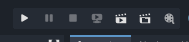

# Godot Engine 4: Crea tú primer videojuego con Godot Engine 4 desdé cero
## Parte 5: Agregando movimiento a nuestro personaje


- [Introducción](#introducción)
- [Agregando las mecánicas de movimiento a nuestro personaje](#agregando-las-mecánicas-a-nuestro-personaje)
- [Creando y asignando un script a nuestro personaje](#creando-y-asignando-un-script-a-nuestro-personaje)
- [Script de la lógica programada de las mecánicas de movimiento y salto](#script-de-la-lógica-programada-de-las-mecánicas-de-movimiento-y-salto)
- [Probando el funcionamiento del script](#probando-el-funcionamiento-del-script)
- [Conlusión](#conclusión)

## Introducción
En el [artículo anterior](articulo_4_4_escena_mundo.md) habíamos creado y diseñado el mapa de la escena World y también posicionado al personaje en el mapa, ahora en este artículo vamos a agregar las mecánicas de movimiento de nuestro personaje.

## Agregando las mecánicas a nuestro personaje
Para agregar las mécancicas a nuestro personaje, vamos a necesitar programar la lógica de cada mecánica en un script GDScript que le asignaremos a nuestro personaje para poder manejar los eventos del teclado y realizar las acciones correspondientes a esas mecánicas de acuerdo a esos eventos del teclado.

## Creando y asignando un script a nuestro personaje

Primero vamos a asignar el script el cual contendrá la lógica programada en **GDScript** de las mecánicas de nuestro personaje, para eso debemos abrir la escena player de nuestro personaje:


Una vez hemos abierto la escena player de nuestro personaje, vamos a asignarle un script, para hacer eso, en el panel de edición de escenas **Scene**, buscaremos en la lista de nodos de la escena Player, el nodo Player o CharacterBody2D si no le hemos cambiado el nombre al nodo, daremos click derecho sobre ese nodo y en el menú de opciones que nos despliega vamos a buscar la opción **Attach Script**:


Daremos click izquierdo sobre esa opción y nos aparecerá una ventana como la siguiente:


Dejaremos todo como está y simplemente daremos click izquierdo sobre el botón **Create**; luego de eso nos debería cambiar el editor al editor de scripts:


Por defecto al asignar un script a un nodo de tipo CharacterBody 2D nos va a generar el código fuente de un script con algunos ejemplos de las mecánicas que podemos programar para ese tipo de nodos, por ejemplo la lógica de la mecánica para mover al personaje mediante el teclado o la mecánica de saltar. 

## Script de la lógica programada de las mecánicas de movimiento y salto

Sin embargo en el script que utilizaremos en este artículo no vamos a utilizar ese mismo código, en su lugar lo remplazaremos por el que aparece a continuación:

```gdscript
extends CharacterBody2D

#######################################################################
# Código fuente del script para las mecánicas del jugador.
#
# Mecánicas implementadas en este código:
# 1. Mecánica de movimiento
# 2. Mecánica de salto
######################################################################


# Factor de gravedad
@export var gravity: float = 20.0

# Velocidad máxima del personaje
@export var maxSpeed: float = 90.0

# Máxima altura que se puede alcanzar en un salto
@export var maxJumpHeight = 400.0

# Variable para comprobar si el jugador está tocando el suelo
var isOnFloor: bool = false

# Dirección del personaje
var direction: Vector2 = Vector2(0,0)

# Función para actualizar la dirección de avance del personaje en relación a las teclas
# que se hayan presionado.
func updatePlayerDirectionByInput():
	direction = Input.get_vector( "ui_left", "ui_right", "ui_up", "ui_down" )

# Función para manejar los eventos de entrada del teclado
func handleInputEvents():
	updatePlayerDirectionByInput()

# Actualiza las variables que indican en que estado se encuentra el personaje
func updatePlayerState():
	isOnFloor = is_on_floor()

# Función para realizar la acción de salto
func performJumpAction():
	velocity.y -= maxJumpHeight

# Función para actualizar sólo la velocidad horizontal
func updateHorizontalPlayerVelocity():
	velocity.x = direction.x * maxSpeed

# Función para actualizar sólo la velocidad vertical
# acá se implementa la mecánica de salto.
func updateVerticalPlayerVelocity():
	if isOnFloor and direction.y < 0.0:
		performJumpAction()

# Función para actualizar la velocidad del personaje
func updatePlayerVelocity():
	updateHorizontalPlayerVelocity()
	updateVerticalPlayerVelocity()

# Función para aplicar el factor de gravedad
func applyGravity():
	velocity.y += gravity

# Función para actualizar la física de nuestro personaje
func updatePlayerPhysics():
	if !isOnFloor:
		applyGravity()

# Función que se encarga del proceso físico del personaje
func _physics_process(_delta):
	handleInputEvents()
	updatePlayerState()
	updatePlayerVelocity()
	updatePlayerPhysics()
	move_and_slide()

```

En este código fuente he tratado que sea lo más descriptivo posible, además de que he agregado comentarios que describen de forma simple lo que hace cada función y variable. En este artículo no se explicará sobre como programar scripts en Godot con GDScript, para aprender sobre GDScript recomiendo leer la [documentación oficial de GDScript](https://docs.godotengine.org/es/stable/tutorials/scripting/gdscript/gdscript_basics.html).

## Probando el funcionamiento del script

Una vez hemos agregado ese código fuente a nuestro script y guardarlo presionando las teclas ctrl+s, lo siguiente que haremos será probar su funcionamiento, para eso, nos fijaremos en la parte superior derecha del editor donde encontraremos la siguiente barra de botones:



Daremos click izquierdo sobre el botón de play , esto es para ejecutar la escena desdé donde se debe de iniciar a ejecutar nuestro videojuego, pero antes de eso la primer vez que hacemos click izquierdo sobre ese botón, nos pedirá que seleccionemos la escena que se ejecutará por defecto cada vez que ejecutemos nuestro videojuego:


Nosotros seleccionaremos la escena World, para hacer eso daremos click izquierdo sobre el botón **Select**, luego de eso nos aparecerá una ventana del explorador de archivos donde debemos buscar el archivo de la escena que queremos que se ejecute por defecto al iniciar nuestro videojuego, en este caso queremos que sea la escena World, por lo que debemos buscar el archivo **world.tscn** de la escena de mundo y seleccionarlo:


Como podemos observar, una vez hemos seleccioando el archivo **world.tscn** de la escena World, se comenzará a ejecutar el videojuego desdé esa escena, como en esta escena tenemos a nuestro personaje posicionado en el mapa, podremos probar el funcionamiento de la lógica que hemos programado en el script de las mecánicas de nuestro jugador, no sólo eso, si no que también vamos a poder hacer pruebas de las animaciones que vamos a implementar en la siguiente parte.

## Conclusión

En este artículo hemos visto como agregar las mecánicas de movimiento del jugador mediante la asignación de un script con la lógica de las mecánicas programadas en GDScript, además hemos aprendido a como seleccionar y ejecutar una escena desdé la cuál debe comenzar a ejecutarse nuestro videojuego para probar las mecánicas de movimiento, en este caso hemos seleccionado la escena World del mapa con el jugador posicionado.

## Siguiente parte
[Parte 6: Agregando animaciones al jugador](articulo_4_6_agregando_animaciones.md)

