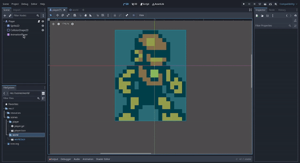
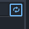

# Godot Engine 4: Crea tú primer videojuego con Godot Engine 4 desde cero
## Parte 6: Agregando animaciones a nuestro personaje


- [Introducción](#introducción)
- [Animando a nuestro personaje](#animando-a-nuestro-personaje)
- [Agregando la animación de caminar](#agregando-la-animación-de-caminar)
- [Agregando los keyframes de la animación de caminar](#agregando-los-keyframes-de-la-animación-de-caminar)
- [Programando las animaciones - Script Completo](#programando-las-animaciones---script-completo)


## Introducción

En el [artículo anterior](articulo_4_5_agregando_movimiento.md) habiamos 
incluyendo las animaciones del personaje, agregaremos también una hitbox o área de colisión y la programaremos para que nuestro personaje pueda detectar las colisiones con los enemigos.


## Animando a nuestro personaje

Para comenzar a trabajar en las animaciones de nuestro personaje, vamos a cambiar el editor actual al editor de escenas 2D, para eso, nos fijaremos en la parte superior del editor:


Y daremos click izquierdo en **2D** para seleccionar el editor de escenas 2D, esto es porque para trabajar en las animaciones de nuestro personaje, vamos a necesitar visualizar a nuestro personaje en el editor para guiarnos mejor en el proceso de creación de las animaciones.

# Agregando la animación de caminar
Para poder crear las animaciones de nuestro personaje, vamos a necesitar utilizar un nuevo nodo de tipo, el nodo AnimationPlayer:


Este nodo básicamente lo que hace es guardar la información de cada una de las animaciones de nuestro personaje, como el nombre de cada animación, el tipo de animación, el tiempo de duración total de la animación, la cantidad de frames, la organización y la duración de cada frame, etc.

Luego de haber agregado el nodo AnimationPlayer a nuestro personaje, lo siguiente que haremos será crear la animación de caminar **walk_animation**, vamos a dar click izquierdo sobre el nodo AnimationPlayer para que nos aparezca el panel de edición de animaciones:



Cuando queramos que nos aparezca ese panel de edición de animaciones, simplemente daremos click izquierdo sobre el nodo AnimationPlayer para seleccionarlo, eso hará que de forma automática se abra ese panel de edición de animaciones.

Ahora en el panel de edición de animaciones, daremos click izquierdo en el botón **Animation** que nos desplegará una lista de opciones para el manejo de animaciones, como crear, eliminar, duplicar, renombrar, etc:


La opción que nos interesa ahora es la opción para crear una nueva animación, la opción **New**, daremos click en la opción de **New** para crear una nueva animación y nos debería aparecer una ventana en la cuál vamos a ingresar el nombre de la nueva animación, y luego daremos click izquierdo sobre el botón **OK** para crear la animación:


En este caso el nombre de la animación será **walk_animation**, ya que esta será la animación de caminar de nuestro personaje, luego de darle click izquierdo al botón **OK** para crear la animación, nos debería de aparecer el panel de edición de animaciones de la siguiente forma:


Ahora que ya hemos creado la nueva animación **walk_animation**, vamos a crear la pista o **track** de keyframes que compondrán la animación de caminar de nuestro personaje. 
Un keyframe es básicamente el estado de un nodo en un momento determinado, como por ejemplo, cada frame que compone a una animación como la animación de caminar, representa un estado distinto del nodo en un momento determinado, de ese modo al tener varios keyframes organizados de forma continua(**track**) podemos componer una animación determinada.

Para poder agregar los keyframes al **track** de la animación **walk_animation**, necesitaremos la ayuda de uno de los nodos que habíamos agregado anteriormente en la escena de nuestro personaje, el nodo Sprite2D que contiene la textura que le da el aspecto visual a nuestro personaje, lo que haremos será que estando en el panel de edición de animaciones con la animación **walk_animation** seleccionada, en el panel de edición de escena **Scene** vamos a seleccionar el nodo Sprite2D dando click izquierdo sobre él:


Al dar click sobre el nodo Sprite2D y teniendo abierto el panel de edición de animaciones con la animación de caminar **walk_animation** seleccionada, eso hará que en el panel Inspector para editar las propiedades del nodo, nos aparezcan unos pequeños botones con iconos de llaves al lado derecho de cada una de las opciones de la sección Animation del panel **inspector**:


Esos botones lo que hacen es ayudarnos a registrar en un keyframe del estado de las propiedades del nodo Sprite2D en un momento determinado, para entender mucho mejor esto, lo que haremos ahora será a comenzar a componer la animación **walk_animation**, para eso haremos lo siguiente:

Primero nos fijaremos en la propiedad **frame**:


Esta propiedad lo que hace es seleccionar el frame actual a mostrar del spritesheet de las posiciones de nuestro personaje. En este caso nos dice que es el frame número 8, que es el frame en el cuál nuestro personaje está en una posición de inactividad **Idle**.

Cada número que le podemos pasar a la propiedad **frame** representa un frame de una determinada posición de nuestro personaje, por lo que sabiendo eso, para poder componer la animación de nuestro personaje, lo que debemos hacer será ir cambiando el frame y registrando esos cambios con un keyframe que se añadirá al **track** de la animación **walk_animation** de nuestro personaje.

## Agregando los keyframes de la animación de caminar
Ahora entendiendo el funcionamiento de la propiedad **frame** del nodo Sprite2D, lo siguiente que haremos será comenzar a agregar los keyframes de la animación de caminar al **track** de la animación **walk_animation**,
para eso ,lo primero que haremos será darle un número a la propiedad **frame** que sea el primer frame de las posiciones de caminar de nuestro personaje, en este caso es el frame número 0: 


Ahora daremos click izquierdo sobre el botón con el icono de llave que está al lado derecho de la propiedad
**frame**, eso nos mostrará una ventana emergente en la que debemos dar click izquierdo en el botón **Create** para comenzar a añadir los keyframes:


Ahora que ya hemos creado el primer keyframe de la animación de caminar, vamos a dar click izquierdo en el mismo botón con el ícono de llave para agregar más keyframes al **track** el número de veces necesarias dependiendo de la cantidad de frames de la animación, en este caso sólo debemos dar click izquierdo 3 veces ya que la animación de caminar del personaje con el que estamos trabajando se compone de 4 keyframes:


Con esto ya tendríamos los keyframes en el **track** de la animación de caminar, ahora lo que nos falta es establecer el tiempo de duración del **track**, en este caso lo estableceremos en 5 milisegundos, ya que son 4 keyframes donde cada uno se tarda 1 milisegundo en el **track**, para hacer eso nos fijaremos en la siguiente parte del editor de animaciones:


Lo cambiaremos a 0.5:


Luego de eso, para que la animación se reproduzca todo el tiempo de forma continua mientras el personaje está realizando una acción, debemos hacer también que la animación se autorrepita cada vez que termina de reproducirse la animación, para eso nos fijaremos en el siguiente botón:


Daremos click izquierdo sobre ese botón y debería tomar una tonalidad azul claro de la siguiente manera:



Con esto finalizariamos el proceso de creación de la animación de caminar **walk_animation**, del mismo modo podemos crear el resto de animaciones de nuestro personaje o incluso de enemigos u objetos.

Estas son las 3 animaciones que tendrá nuestro personaje:

1. Animación de inactividad **idle_animation**:


2. Animación de caminar **walk_animation**:


3. Animación de saltar **jump_animation**:


## Programando las animaciones - Script Completo

Ahora que ya hemos creado las animaciones de nuestro personaje, necesitamos programar en el script de nuestro personaje, cómo se reproducirán las animaciones en cada acción o estado de nuestro personaje, para eso, nos iremos al editor de scripts, y allí en el script del personaje
lo que haremos será reemplazar el código que habíamos agregado de la parte de las mecánicas, y añadir el siguiente que contiene la lógica de las animaciones:

```gdscript
extends CharacterBody2D

#######################################################################
# Código fuente del script para manejar las mecánicas y estados del jugador.
#
# Mecánicas implementadas en este código:
# 1. Mecánica de movimiento
# 2. Mecánica de salto
# 3. Actualización y reproducción de las animaciones
# de acuerdo al estado del jugador en un momento determinado.
######################################################################

# Factor de gravedad
@export var gravity: float = 20.0

# Velocidad máxima del personaje
@export var maxSpeed: float = 90.0

# Máxima altura que se puede alcanzar en un salto
@export var maxJumpHeight = 400.0

# Animación actual del personaje
@export var currentPlayerAnimation: String = "idle_animation"

# Variable para comprobar si el jugador está tocando el suelo
var isOnFloor: bool = false

# Variable para comprobar si el jugador se está moviendo
var playerIsMoving: bool = false

# Variable para comprobar la dirección del jugador y saber si se
# debe voltear horizontalmente la animación
var flip_horizontal_animation: bool = false

# Dirección del personaje
var direction: Vector2 = Vector2(0,0)

# Nodo del sprite del personaje
@onready var sprite: Sprite2D = $Sprite2D

# Nodo de animaciones del personaje
@onready var animations: AnimationPlayer = $AnimationPlayer

# Función para actualizar la dirección de avance del personaje en relación a las teclas
# que se hayan presionado.
func updatePlayerDirectionByInput():
	direction = Input.get_vector( "ui_left", "ui_right", "ui_up", "ui_down" )

# Función para manejar los eventos de entrada del teclado
func handleInputEvents():
	updatePlayerDirectionByInput()
	if Input.is_key_pressed(KEY_ESCAPE):
		get_tree().quit()

# Actualiza las variables que indican en que estado se encuentra el personaje
func updatePlayerState():
	isOnFloor = is_on_floor()

# Función para realizar la acción de salto
func performJumpAction():
	velocity.y -= maxJumpHeight

# Función para actualizar sólo la velocidad horizontal
func updateHorizontalPlayerVelocity():
	velocity.x = direction.x * maxSpeed

# Función para actualizar sólo la velocidad vertical
# acá se implementa la mecánica de salto.
func updateVerticalPlayerVelocity():
	if isOnFloor and direction.y < 0.0:
		performJumpAction()

# Función para actualizar la velocidad del personaje
func updatePlayerVelocity():
	updateHorizontalPlayerVelocity()
	updateVerticalPlayerVelocity()

# Función para aplicar el factor de gravedad
func applyGravity():
	velocity.y += gravity

# Función para actualizar la física de nuestro personaje
func updatePlayerPhysics():
	if !isOnFloor:
		applyGravity()

# Función para comprobar si el jugador se está moviendo
func checkPlayerIsMoving():
	return velocity.length() != 0.0 or !isOnFloor
	
# Función para parar la animación del personaje
func stopPlayerAnimation():
	animations.stop()

# Función para reproducir la animación actual del personaje
func playPlayerAnimation():
	animations.play(currentPlayerAnimation)

# Función para comprobar si la velocidad horizontal del
# jugador es diferente de cero.
func checkPlayerHorizontalVelocity():
	return velocity.x != 0.0

# Función para comprobar la dirección horizontal del jugador
func checkPlayerHorizontalDirection():
	if checkPlayerHorizontalVelocity():
		sprite.flip_h = velocity.x < 0.0

# Función para establecer la animación actual del jugador
func setPlayerCurrentAnimation( animationName: String = "idle" ):
	currentPlayerAnimation = animationName + "_animation"

# Función para comprobar y seleccionar la animación actual 
# del personaje en relación a su movimiento
func checkCurrentPlayerAnimation():
	if !checkPlayerIsMoving():
		setPlayerCurrentAnimation()
		return
	
	checkPlayerHorizontalDirection()
	
	if isOnFloor and checkPlayerHorizontalVelocity():
		setPlayerCurrentAnimation("walk")
		return
	
	setPlayerCurrentAnimation("jump")
	

# Función para actualizar las animaciones del personaje
func updatePlayerAnimations():
	checkCurrentPlayerAnimation()
	playPlayerAnimation()

# Función que se encarga del proceso físico del personaje
func _physics_process(_delta):
	handleInputEvents()
	updatePlayerState()
	updatePlayerVelocity()
	updatePlayerAnimations()
	updatePlayerPhysics()
	move_and_slide()
```

## Conclusión
En este artículo hemos aprendido a como crear animaciones y el manejo básico del editor de animaciones, además hemos agregado la lógica de las animaciones en el script del jugador.

## Siguiente parte
[Parte 7: Agregando una hitbox a nuestro personaje](articulo_4_7_agregando_hitbox.md)

