# Godot Engine 4: Crea tú primer videojuego con Godot Engine 4 desde cero
## Parte 7: Agregando una hitbox a nuestro personaje

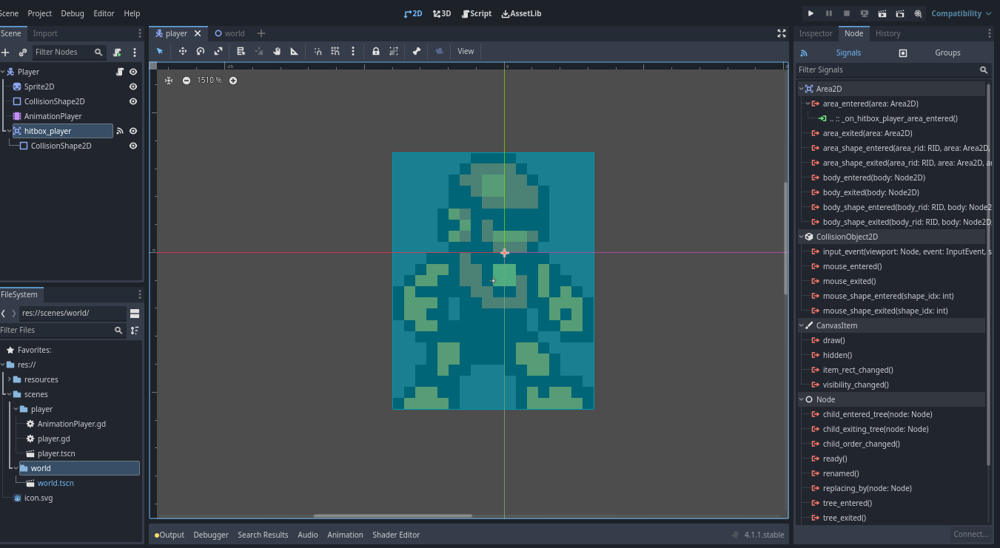

- [Introducción](#introducción)
- [¿Qué es la hitbox?](#¿qué-es-la-hitbox)
- [Agregando una hitbox a nuestro personaje](#agregando-una-hitbox-a-nuestro-personaje)
- [Breve introducción a señales](#breve-introducción-a-señales)
- [¿Qué es una señal?](#¿qué-es-una-señal)
- [Emisión de señales de la hitbox del jugador](#emisión-de-señales-de-la-hitbox-del-jugador)
- [Respondiendo a señales](#respondiendo-a-señales)
- [Conclusión](#conclusión)
- [Siguiente parte](#siguiente-parte)

## Introducción
En el [artículo anterior](articulo_4_6_agregando_animaciones.md) aprendimos a cómo crear y agregar animaciones al personaje de nuestro videojuego, además de que agregamos la lógica programada de las animaciones al script asignado al nodo del personaje.
Ahora en esté artículo veremos otra parte fundamental para la interacción de nuestro personaje con las entidades del entorno, la [hitbox](https://en.wikipedia.org/wiki/Collision_detection#Hitbox), aprenderemos a cómo crear una hitbox para nuestro personaje y la programaremos para que detecte la colisión del personaje con los enemigos.
 
## ¿Qué es la hitbox? 
La hitbox básicamente es una caja de colisión, pero a diferencia de la caja de colisión para la detección de colisiones con el mapa, la hitbox detecta las colisiones con otras entidades específicas en el mapa, como los enemigos u objetos que pueden hacer daño al jugador mediante el contacto.

Es importante destacar que también existe el concepto de **hurtbox** o **caja de daño**, también es una caja de colisión al igual que la hitbox, la diferencia que es la hurtbox se utiliza en el personaje para detectar la colisión con la hitbox de los enemigos y así poder determinar cuándo recibe daño el jugador.

Sin embargo el concepto de hitbox se utiliza más comunmente que el concepto de hurtbox, ya que ambos conceptos son intercambiables entre sí, pero considero que es importante aclarar la diferencia entre estos 2 conceptos a pesar de estar tan relacionados entre sí.

## Agregando una hitbox al personaje

Agregar una hitbox a un personaje, es muy similar al proceso de añadir las colisiones mediante un nodo CollisionShape2D, sólo con algunas diferencias en el proceso cómo los nodos de área y el concepto de señales.

Para agregar una hitbox, necesitaremos la ayuda de otro tipo de nodo especial, el nodo Area2D, esté tipo de nodos son utilizados para crear áreas de colisión para el jugador, enemigos, u objetos en general. La diferencia del área de colisión a la caja de colisión es que el área de colisión sólo detecta cuándo otra área de colisión interactua con ella más no impide que las colisiones se atraviesen entre sí cómo es en el caso de las cajas de colisiones.

Para crear un nodo de tipo Area2D, el proceso es el mismo que hemos seguido hasta ahora para crear nodos de diferentes tipos, el nodo lo crearemos en la escena Player o CharacterBody2D de nuestro personaje:

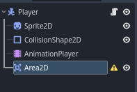

Como podremos observar, al lado del nodo aparece un ícono de un triángulo de advertencia amarillo, eso es porque al área de colisión debemos de proporcionarle también como será la forma de su área de colisión.
Para darle forma al área de colisión, lo que haremos será agregarle un nodo de tipo CollisionShape2D:

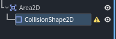

Luego haremos será hacer lo mismo que hicimos cuándo le agregamos colisión a nuestro personaje, al CollisionShape2D en el inspector le daremos forma rectangular:

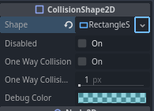

Y haremos que la forma de la colisión del CollisionShape2D del Area2D, sea igual al CollisionShape2D que habíamos agregado a nuestro personaje para que detectará las colisiones con el mapa:

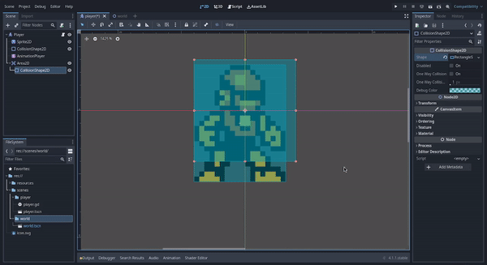

Ahora le cambiaremos el nombre al nodo Area2D de la siguiente forma:

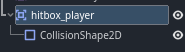

Esto es para poder identificar luego en otras áreas de colisión, el nombre del área de colisión del jugador cuándo está interaccione con el área de colisión de otros objetos o entidades como las de los enemigos.

## Breve introducción a señales

Luego de haber creado el nodo de área de colisión Area2D y haber establecido su forma de colisión y cambiado su nombre para poder identificarla luego en la interacción con otras área de colisión, lo que haremos ahora será hacer que ese nodo emita una señal cada vez que interactúe con otra área de colisión.

Pero antes de eso debemos entender que son las señales y porque son tan importantes para la implementación de funcionalidades que requieran manejar los estados de un nodo en ciertas situaciones.

## ¿Qué es una señal?

Las señales son mensajes que un nodo envía o emite cuándo su estado es afectado por algún evento, por ejemplo, cuándo el nodo de la hitbox del jugador detecta que hay contacto con la hitbox de un enemigo, el nodo de la hitbox del jugador puede emitir una señal a la cuál se puede conectar el nodo del jugador para manejar ese evento, que en ese caso sería un evento de recibir daño por el contacto con un enemigo.

Para profundizar más sobre señales en Godot, recomiendo leer la [documentación óficial](https://docs.godotengine.org/es/stable/getting_started/step_by_step/signals.html).


## Emisión de señales de la hitbox del jugador

Para hacer que la hitbox del jugador emita señales cada vez que entra en contacto con la hitbox de otras entidades como los enemigos, debemos hacer que esa señal sea manejada desdé el script del jugador.

Lo primero que debemos hacer será seleccionar el nodo de la hitbox del jugador:

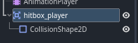

Eso hará que nos aparezcan sus propiedades en el panel Inspector:

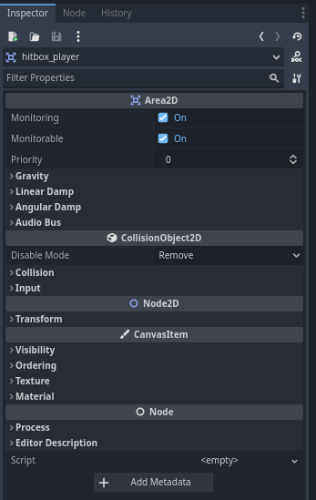

En la parte superior del panel Inspector, al lado derecho podremos observar otra pestaña llamada Node, daremos click izquierdo sobre esa pestaña y nos debería de mostrar el siguiente panel:

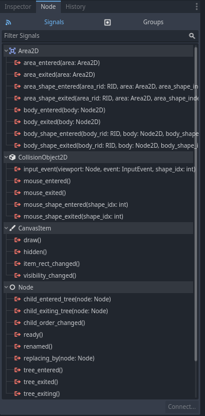

Como podremos observar, nos muestra una gran variedad de opciones de las señales que puede emitir el nodo del área de la hitbox en diferentes tipos de situaciones, la señal que nos interesa por ahora es la primera **area_entered(area: Area2D)**, está señal se emite cuándo el área de la hitbox detecta el ingreso o contacto de otra área, que puede ser el área de la hitbox de otra entidad como los enemigos.

Luego para conectar esa señal al nodo del jugador, daremos doble click izquierdo sobre la opción de esa señal, y nos debería aparecer una ventana emergente de la siguiente forma:

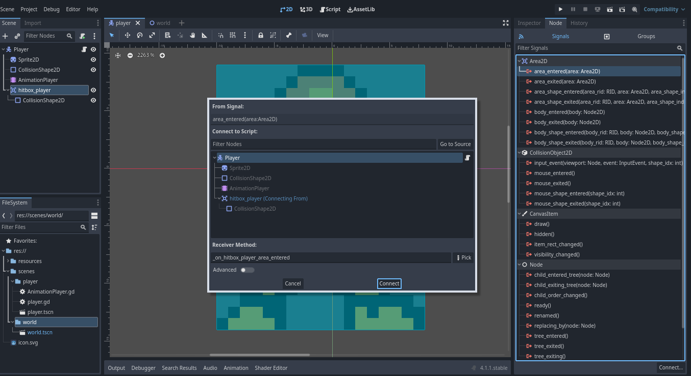

Cómo el único nodo con un script asignado es el script del jugador, es el único nodo que nos aparece disponible para conectar la señal, esto es debido a que para poder conectar la señal de un nodo a otro nodo, el nodo receptor de la señal debe tener un script asignado en el cuál se programará la lógica encargada al manejo de esa señal.

Daremos click izquierdo sobre el botón **Connect** y nos debería cambiar al editor del script asignado al jugdaor dónde podemos observar que nos añadío el siguiente método:

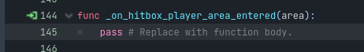

Y ahora reemplazaremos el código de ese método con el siguiente código:

```gdscript
# Función que se encarga de manejar la señal emitida
# por el nodo de la hitbox al nodo del jugador.
func _on_hitbox_player_area_entered(area):
    # Detectar sólo las áreas de las hitbox de los enemigos
	if area.name == "hitbox_enemy":
		get_tree().reload_current_scene()
```
En este código se implementa la lógica para manejar la señal cada vez que el nodo de la hitbox del jugador la emite al nodo del jugador.

## Conclusión
Con esto finalizaríamos el conjunto de características básicas que debe tener el personaje principal en un videojuego, en esté artículo vimos los conceptos de hitbox, hurtbox y sus diferencias, y también vimos una breve introducción a lo que son las señales.

## Siguiente parte
[Parte 8(final): Creación de la escena enemigo](articulo_4_8_escena_enemigo.md)


