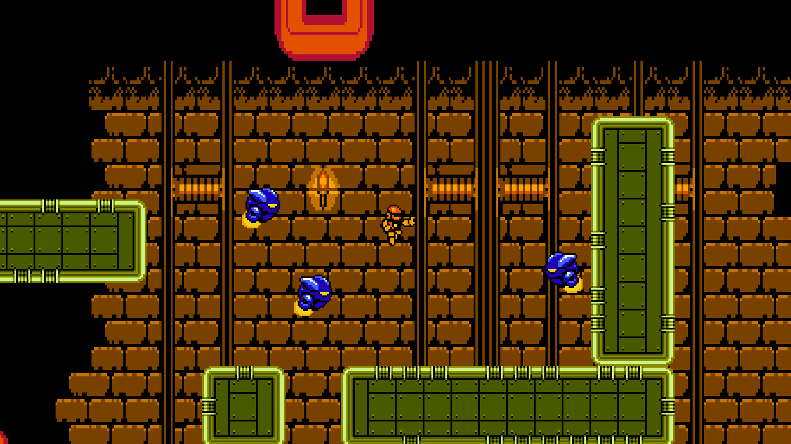
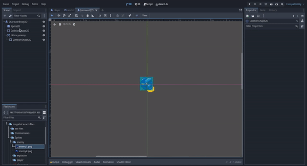

# Godot Engine 4: Crea tú primer videojuego con Godot Engine 4 desdé cero
## Parte 8 (final): Creación de la escena enemigo 



- [Introducción](#introducción)
- [Creando la escena Enemy](#creando-la-escena-enemy)
- [Proceso de la creación de la escena Enemy](#proceso-de-la-creación-de-escena-enemy)
    * [Creamos una nueva escena](#1-creamos-una-nueva-escena)
    * [Creamos el nodo CharacterBody2D](#2-creamos-el-nodo-characterbody2d)
    * [Dándole apariencia gráfica](#3-dándole-apariencia-gráfica)
    * [Agregándole colisiones](#4-agregándole-colisiones)
    * [Agregándole la hitbox](#5-agregándole-la-hitbox)
    * [Agregando un área de detección](#6-agregando-un-área-de-detección)
    * [Le asignamos un script](#7-le-asignamos-un-script)
    * [Conectando la señal del área de detección](#8-conectando-la-señal-del-área-de-detección)
    * [Programando el script](#9-programando-el-script)
    * [Cambiando el nombre del nodo CharacterBody2D](#10-cambiando-el-nombre-del-nodo-characterbody2d)
    * [Configurando el collision layer y collision mask](#11-configurando-el-collision-layer-y-collision-mask)
    * [Finalizando la escena](#12-finalizando-la-escena)
- [Colocando enemigos en el mapa](#colocando-enemigos-en-el-mapa)
- [Conclusión](#conclusión)

## Introducción 
En las partes anteriores de este artículo hemos visto la mayoría de conceptos básicos para la creación de los componentes de un videojuego, cómo las escenas, nodos, scripts, mecánicas, animaciones, señales, colisiones, mapas, etc. Con todo el conocimiento que hemos ido adquiriendo a lo largo de las diferentes parte de este artículo, podremos crear cualquier otro componente de nuestro videojuego, cómo por ejemplo, ahora crearemos la escena que utilizaremos para los enemigos que colocaremos en el mapa de nuestro videojuego.
 
## Creando la escena Enemy

El proceso de creación de la escena para los enemigos es prácticamente el mismo proceso que seguimos durante la creación de la escena Player para el jugador, por lo que en este artículo presentaré el mismo proceso de forma resumida.

## Proceso de la creación de escena Enemy


### 1. Creamos una nueva escena:


### 2. Creamos el nodo CharacterBody2D 
Así como cuándo creamos la escena Player del jugador, vamos a crear un nodo de tipo CharacterBody2D:


### 3. Dándole apariencia gráfica
Le daremos apariencia gráfica así como hicimos en la escena Player:


### 4. Agregándole colisiones:
Agregaremos el nodo CollisionShape2D para que colisione con el mapa:


### 5. Agregándole la hitbox
Agregaremos el área de colisión de la hitbox y le cambiamos el nombre a "hitbox_enemy":


### 6. Agregando un área de detección
El proceso es el mismo para agregar la hitbox, la única diferencia es que en vez de utilizar una forma de colisión rectángular, utilizaremos una forma de colisión circular: 



Luego le cambiaremos el nombre a detect_zone:


El área de detección servirá para detectar cuándo el jugador está a una cierta distancia del enemigo para que este comience a perseguirlo.

### 7. Le asignamos un script 

Le asignaremos un script para programar la lógica de las mecánicas de movimiento y persecusión mediante el manejo de las señales emitidas por el área de detección:


### 8. Conectando la señal del área de detección

Conectaremos la señal **area_entered(area: Area2D)** del área de detección con el nodo CharacterBody2D al igual que hicimos con el área de la hitbox del jugador:


### 9. Programando el script 
En el script asignado al nodo CharacterBody2D reemplazaramos su código por el siguiente:

```gdscript
extends CharacterBody2D

#######################################################################
# Código fuente del script para manejar las mecánicas y estados del enemigo.
#
# Mecánicas implementadas en este código:
# 1. Manejo de la señal de detección del jugador
# 2. Mecánica de movimiento con leyes de inercia y fricción
# 3. Mecánica de persecución
######################################################################

# Nodo del sprite del enemigo
@onready var sprite: Sprite2D = $Sprite2D

# Velocidad de persecución
@export var choseSpeed: float = 90.0

# Voltear el sprite horizontalmente dependiendo de la dirección
var flipSprite = false

# Variable para detectar si el jugador está en la zona
# de detección del jugador
var playerIsInDetectZone: bool = false

# Nodo del jugador para obtener su posición actual
var playerNode: CharacterBody2D

# Función para aplicar el factor de fricción a la velocidad del enemigo.
func applyFriction():
	velocity *= 0.98
	
# Función para mover al enemigo hacía el jugador
func moveEnemyToPlayer():
	var direction: Vector2 = ( playerNode.position - position ).normalized()
	flipSprite = velocity.x > 0.0	
	velocity += direction * 2.5	

func updateSpriteFlip():
	sprite.flip_h = flipSprite

# Función que se encarga de actualizar el estado del sprite 
# de acuerdo al estado del enemigo
func updateEnemySprite():
	updateSpriteFlip()

# Función que se encarga de hacer que el enemigo persiga al jugador
func chosePlayer():
	if playerIsInDetectZone:
		moveEnemyToPlayer()

# Función que se encarga del proceso físico del enemigo.
func _physics_process(_delta):
	chosePlayer()
	applyFriction()	
	updateEnemySprite()
	move_and_slide()

# Función que se encarga de manejar la señal emitida
# por el nodo del área de detección cuándo detectá al jugador.
func _on_detect_zone_area_entered(area):
	if area.name == "hitbox_player":
		playerNode = area.get_parent()
		playerIsInDetectZone = true
```

### 10. Cambiando el nombre del nodo CharacterBody2D

Cambiaremos el nombre del nodo CharacterBody2D a Enemy para que sea más descriptivo el nombre del nodo para cuándo lo utilicemos en los mapas:


### 11. Configurando el Collision Layer y Collision Mask 

Para que no haya problemas entre las colisiones de los enemigos y el jugador, estableceremos el **Collision Layer** y el **Collision Mask** del nodo Enemy a la capa 2:


De ese modo cuando el enemigo se mueva con el mapa, sólo se detendrá por las colisiones con el entorno y no por las colisiones del jugador.

### 12. Finalizando la escena
Para finalizar, guardamos la escena presionando ctrl+s y seguiremos el mismo proceso que hicimos cuándo guardamos la escena Player:
1. Creamos una carpeta enemy en la carpeta scenes.
2. Guardamos el archivo como enemy.tscn

La escena finalizada nos debería de quedar así:


## Colocando enemigos en el mapa

Una vez hemos finalizado la escena Enemy para los enemigos, ahora vamos a colocarlos en la escena World del mapa de nuestro videojuego, el proceso es el mismo de cuándo posicionamos al jugador en el mapa, la única diferencia es que ahora vamos a posicionar varios enemigos en varias partes del mapa:


## Conclusión

En esta parte hemos visto el proceso de creación de la escena Enemy que utilizamos para la creación de enemigos en el mapa de la escena World de nuestro videojuego de modo que ahora el jugador tiene que ir de los enemigos cada vez que lo persiguen dándole más vida a nuestro videojuego, y así como ese podemos crear las escenas de los enemigos que queramos y agregarlas al mapa, además de que podemos también modificar el mapa a nuestro antojo para mejorar la jugabilidad y hacer más divertido nuestro videojuego.

Felicidades, con esto finalizamos la creación de nuestro primer videojuego en Godot y lo mejor es que puedes seguir modificandolo y agregando nuevas mecánicas y funcionalidades a tu gusto, eso ya depende de tu creatividad para usar las herramientas que te ofrece Godot.
En esta serie de artículos hemos aprendido sobre los conceptos básicos y el uso básico de las herramientas que nos ofrece Godot, recomiendo que para profundizar más sobre las herramientas que nos ofrece Godot para la creación de videojuegos, recomiendo leer la [documentación oficial de Godot]() además de buscar tutoriales y recursos en línea ya que Godot posee una gran comunidad y hay mucho contenido sobre él tal como mencionamos en el primer artículo de esta serie.

Agradezo mucho a todos los que se tomaron el tiempo para leer esta serie de artículos, espero les haya sido de su agrado y de gran utilidad, les deseo grandes exitos y prosperidad en sus recorridos como desarrolladores de videojuegos. 

**¡Hasta la próxima!**


