# Godot Engine 4: Crea tú primer videojuego con Godot Engine 4 desdé cero

- [Introducción](#introducción)
- [Creando el proyecto para nuestro videojuego](#creando-el-proyecto-para-nuestro-videojuego)
- [Una breve introduccion a la interfaz grafica del editor de godot](#veamos-una-breve-introduccion-a-la-interfaz-grafica-del-editor)
- [Comencemos a crear nuestro primer videojuego](#comencemos-a-crear-nuestro-primer-videojuego)
- [Creando la escena player](#creando-la-escena-player)
- [Dándole apariencia a nuestro personaje](#dándole-apariencia-a-nuestro-personaje)
- [Conclusión]

## Introducción
En el [artículo anterior](articulo_3_nodos_y_escenas.md) aprendimos lo básico sobre los nodos y las escenas, sin embargo no vimos como crearlos y utilizarlos, en este artículo vamos crear nuestro primer videojuego con todo lo que hemos visto hasta ahora, veremos por ejemplo como crear las escenas y nodos para el jugador, los enemigos, y un nivel usandola para demostrar como funcionan las **estructuras de escenas y nodos** en Godot.

**¡Empezemos!**

## Creando el proyecto para nuestro videojuego
Primero vamos a crear el proyecto para nuestro primer videojuego en Godot, en el [segundo artículo de esta serie](articulo_2_introduccion_a_godot.md#creando-un-nuevo-proyecto-en-godot) vimos cómo crear un proyecto en Godot por lo que en este artículo no vamos a profundizar mucho en esta parte.

### Veamos una breve introduccion a la interfaz grafica del editor

Una vez hemos creado nuestro proyecto, deberá aparecernos una interfaz como la siguiente:

En la parte superior veremos un panel con las siguientes opciones: 

* La opción 2D es para utilizar el editor de escenas 2D.
* La opción 3D es para utilizar el editor de escenas 3D.
* La opción Scripts es para abrir la interfaz del editor de scripts.
* La opción Asset Libs es para abrir el navegador de assets y librerías en línea qué podemos utilizar en nuestro proyecto.

En este artículo nos centraremos principalmente en la opción de 2D y la opción Scripts.

Seleccionamos la opción 2D y nos quedará de la siguiente forma:

Podremos observar varios paneles de edición de nodos y escenas, administración de archivos, e incluso un panel de pestañas para la edición de animaciones, audio, tilesets, tilemaps, y realizar pruebas de nuestros videojuegos mediante depuraciones.

En este artículo no vamos a profundizar mucho sobre cada uno de los componentes de la interfaz gráfica del editor de Godot más allá de los que vamos a utilizar, por lo que si quieres aprender más sobre cada uno de estos componentes te recomiendo leer la [documentación óficial de godot sobre la interfaz gráfica](https://docs.godotengine.org/es/stable/getting_started/introduction/first_look_at_the_editor.html) o buscar tutoriales y cursos en linea.

## Comencemos a crear nuestro primer videojuego

Ahora que ya hemos visto una breve una introducción a la interfaz gráfica del editor de Godot y tenemos una noción de los conceptos básicos de Godot, podemos comenzar a crear nuestro propio videojuego con las herramientas que nos ofrece. 

Antes de comenzar veamos cuales serán los elementos básicos que tendrá nuestro videojuego:

1. Un personaje jugable
2. Un nivel con un gameplay basico
3. Enemigos con mecanicas sencillas

Descargaremos también un paqueté de recursos(assets pack) de sprites para la creación de nuestro videojuego, en este caso utilizaré el asset pack del proyecto [Mega Bot](https://ansimuz.itch.io/mega-bot) que es un videojuego al estilo Mega Man.

Enlace: https://ansimuz.itch.io/mega-bot

Daremos click izquierdo en el bóton que dice **Dowload Now** y luego si no queremos donar, damos click dónde dice **No thanks, just take me to the downloads**, y los enviará a la siguiente página: 

Descargaremos el archivo que dice megabot asset files.zip: 

Una vez descargado, lo descomprimimos, quedandonos la siguiente carpeta:

En el interior de esa carpeta encontraremos otra carpeta del mismo nombre, esa carpeta la copiaremos en la carpeta de nuestro proyecto en godot y nos debe de quedar de la siguiente manera:

Una vez tenemos la carpeta con los assets en la carpeta de nuestro proyecto, volvemos a godot y revisamos en el panel de exploración de archivos de nuestro proyecto si todo salío bien se debería de ver así:

## Creando la escena Player
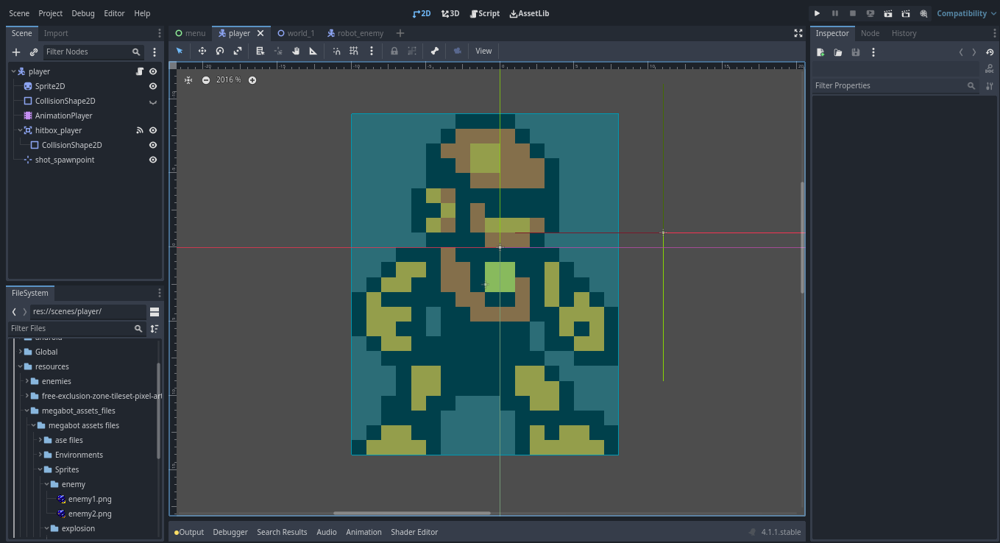

Vamos ahora a crear la escena player o jugador de nuestro personaje.
Lo primero debemos hacer es agregar un nodo de tipo CharacterBody2D que será el nodo principal de la estructura de la escena de player, para eso nos vamos al panel de edición de escena:

Daremos click izquierdo en el botón **Other Node** y nos aparecerá una ventana como la siguiente:

En este panel podemos ver todos los tipos de nodos disponibles que podemos usar en godot por ahora buscaremos el nodo CharacterBody2D que es el que vamos a usar, para eso daremos click izquierdo en el campo de texto debajo de **Search** y escribimos CharacterBody2D:

Lo seleccionamos y damos click izquierdo en en el botón **Create** para crear el nodo.

Una vez creado nos aparecerá en el panel de edición de escenas de la siguiente manera:

**¡Felicidades, hemos creado nuestro primer nodo de escena en Godot!**

Los nodos de tipo CharacterBody2D se útilizan para la creación de personajes y enemigos en los videojuegos, contienen por ejemplo las propiedades para la posición y desplazamiento de los enemigos y nuestro personaje además de un sistema heredado para la detección de colisiones, para más información sobre este tipo de nodos recomiendo leer la [documentación óficial de godot sobre los nodos de tipo CharacterBody2D](https://docs.godotengine.org/en/4.1/tutorials/physics/using_character_body_2d.html).

### Dándole apariencia a nuestro personaje

Ahora que ya tenemos creado el nodo CharacterBody2D, debemos darle el aspecto gráfico que tendrá en el juego.

Lo primero que debemos hacer será crear un nodo de tipo Sprite2D al interior del nodo CharacterBody2D que hemos creado anteriormente, para eso debemos dar click derecho sobre el nodo CharacterBody2D en el panel de edición de escena y nos debe desplegar un menú como el siguiente:

Y daremos click izquierdo en la opción que dice **Add Child Node** para desplegar nuevamente la ventana de selección del tipo de nodo a añadir:
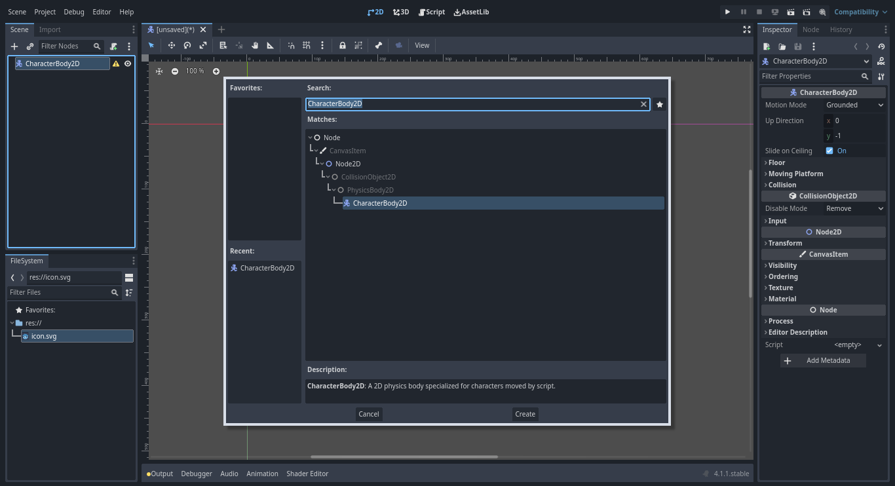

Veremos que estará en la busqueda anterior que hicimos para el nodo CharacterBody2D, ahora daremos click izquierdo en el campo de texto debajo de **Search:** borramos y escribimos Sprite2D:
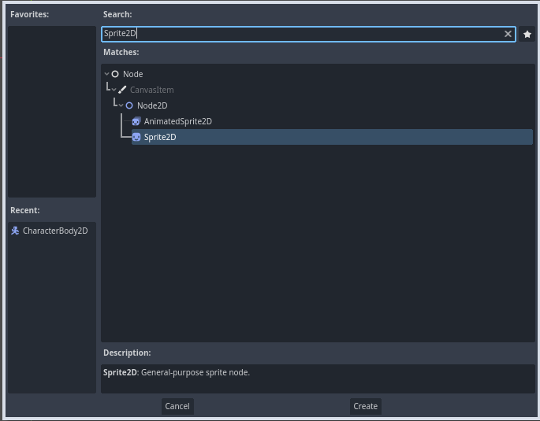

Y por último daremos click izquierdo en el botón **Create** para crear el nuevo nodo.
Una vez creado el nuevo nodo, la estructura de la escena nos debe de quedar como la siguiente:

Como podemos ver el nuevo nodo que acabamos de crear se a creado adentro del nodo CharacterBody2D, así es cómo los nodos se pueden crear en el interior de otros nodos, y lo mismo podemos hacer con otros nodos que se encontrarán en el interior de otros nodos.

Los nodos Sprite2D con este tipo de nodos podemos darle el aspecto gráfico que tendran nuestros personajes o enemigos.

Bien, ahora que hemos creado el nodo Sprite2D, lo siguiente será asignarle la imagen o textura del aspecto gráfico de nuestro personaje, en mi caso voy a utilizar un sprite sheet del personaje MegaBot del asset pack que descargamos.

Vamos ahora a desplegar esa carpeta y en su interior nos deberían de aparecer otras 3 carpetas:

Desplegaremos la carpeta Sprites:

Podemos ver una imagen en formato .png llamada **player.png** que es la textura que utilizaremos para darle aspecto a nuestro personaje, para asignarla al nodo Sprite2D que habíamos creado lo que debemos hacer es hacer mantener click izquierdo sobre esa imagen y arrastrarla y soltarla en el nodo Sprite2D que está en la parte superior en el editor de escena y soltarlo en él:

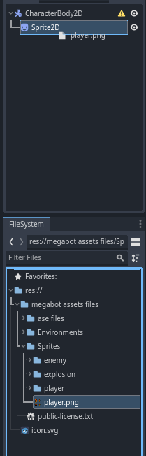

Y nos debe ahora aparecer la textura así:

Podemos hacer zoom con la rueda del ratón y movernos horizontal y vérticalmente con las barras de desplazamiento que aparecen en la parte inferior y la parte derecha del editor visual:

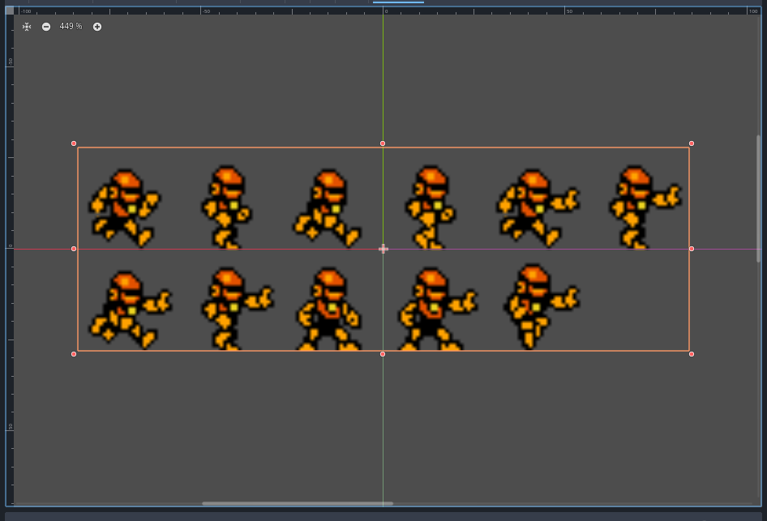

Ahora para elegir un sólo sprite de las animaciones del robot primero debemos dar click izquierdo sobre el nodo Sprite2D:

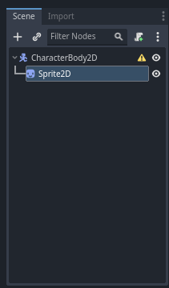

Y luego nos vamos a ir a la parte derecha del editor de godot en el pánel Inspector:

Acá en este panel podremos editar las propiedades de los nodos.

Ahora queremos editar cómo se muestra la textura de nuestro personaje en el videojuego, para eso daremos click izquierdo en la opción que dice Animation:

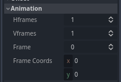

En HFrames( cantidad de columnas de frames que posee el sprite sheet de nuestro personaje ), colocaremos 6 y nos quedará de la siguiente manera:

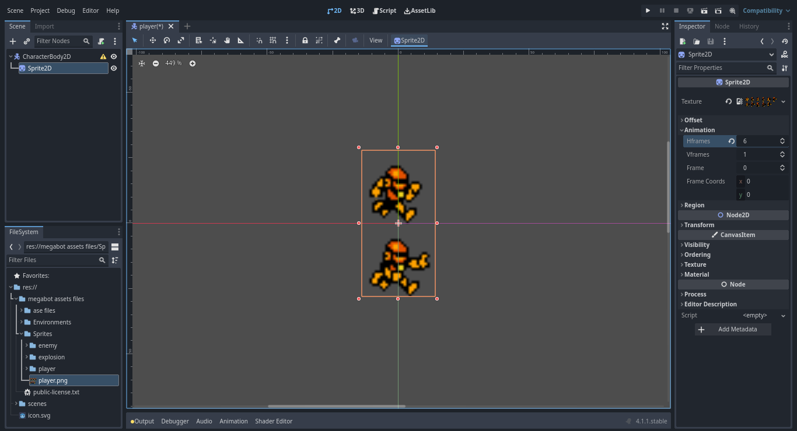

Ahora en VFrames( cantidad de filas de frames que posee el sprite sheet de nuestro personaje ), colocaremos 2 y nos quedará de la siguiente manera:

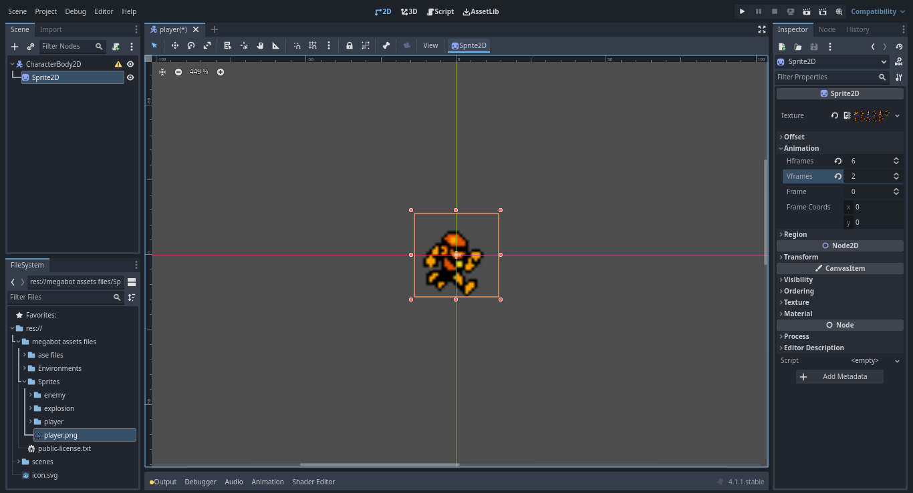

Y ahora para seleccionar el frame en el que mostrar a nuestro personaje por defecto, en la parte parte de Frame colocaremos el número 8:

**¡Ya nuestro personaje tiene apariencia!**

Pero, si nos acercamos más al personaje verémos cómo si se difuminara:

Para arreglar eso debemos irnos a la parte superior izquierda del editor dónde podemos observar las siguientes opciones:

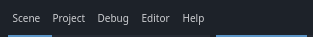

Daremos click izquierdo en Project, y luego en project settings:

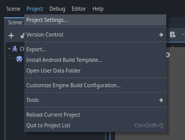

Y nos debe aparecer la siguiente ventana:

En esta ventana nosotros podemos modificar las configuraciones de nuestro proyecto, ahora nos interesa son las configuraciones de las texturas, para eso nos iremos a la parte de Rendering y darémos click izquierdo en Textures:

Al hacer click izquierdo, nos debe aparecer el siguiente panel de configuraciones:

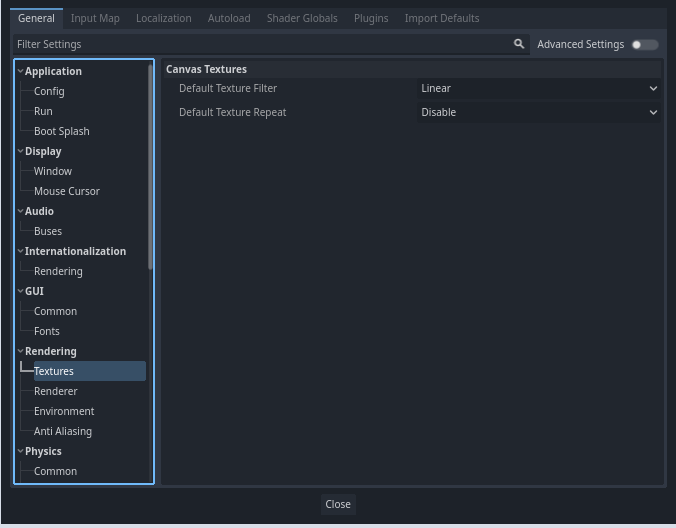

Dónde dice Default Texture Filter, daremos click izquierdo en donde dice **Linear** y nos deben aparecer las siguientes opciones:

Seleccionamos la que dice **Nearest** y cerramos la ventana de configuraciones.

Y si todo sale bien, como podemos observar ahora nuestro personaje se verá así:

### Colisiones de nuestro personaje
### Moviendo a nuestro personaje
### Animando a nuestro personaje

## Creando la escena World
### Añadiendo nuestro personaje a la escena World
### Creando y diseñando el mapa
### Añadiendo colisiones al mapa
### Añadiendo un fondo al mapa

## Creando la escena enemigo

## Conclusión

